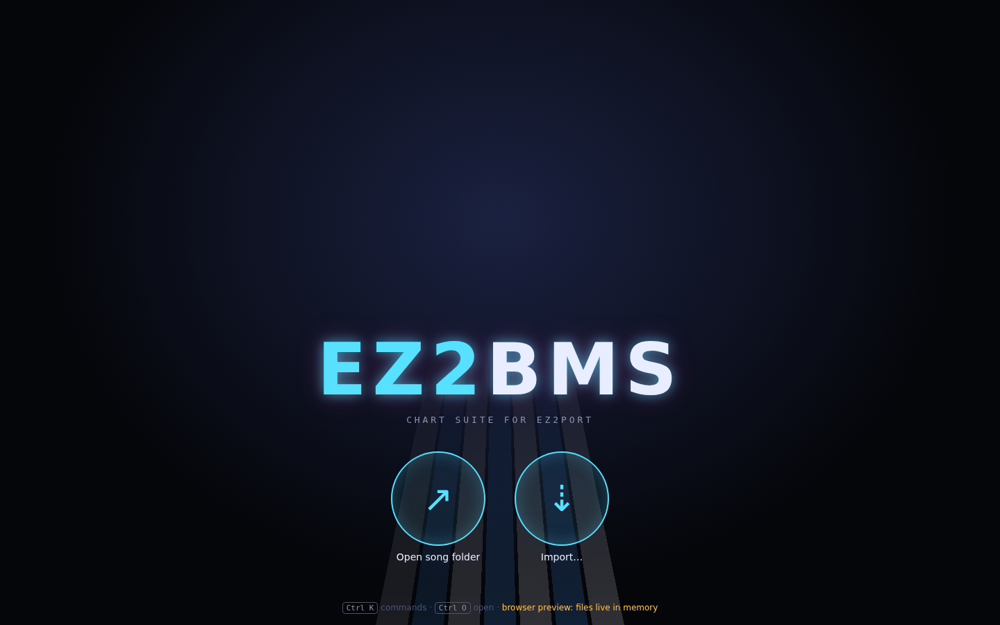

# Editor tour

This chapter walks around the EZ2BMS window: the start screen, the top bar, the play field and
minimap, the drawers, the status bar, and the messages EZ2BMS shows you. Later chapters explain
each feature in depth; this one tells you where things are.

## The start screen

When no song is open, EZ2BMS shows its start screen.

- **Recent songs** appear as discs. Click one to open it again. EZ2BMS remembers your last eight
  song folders.
- **Open song folder** opens a folder with a song in it (<kbd>Ctrl</kbd>+<kbd>O</kbd>). A song is
  a folder: its charts, its sounds and its art live together in it.
- **Import…** brings in a song from EZ2AC, BMS or bmson (see [Importing](15-import.md)).
- **New song** starts a song in an empty folder, or in a folder that already has its sounds.
  (Desktop app only.)

The line at the bottom reminds you of <kbd>Ctrl</kbd>+<kbd>K</kbd> for commands and
<kbd>Ctrl</kbd>+<kbd>O</kbd> to open. In the browser preview it also says
**browser preview: files live in memory**.

## The editor at a glance

From top to bottom:

- the **top bar**: the song, its charts, where the cursor is, and the view switch;
- the **Sounds** drawer on the left, the **play field** with its **minimap** in the middle, and
  the right drawer;
- the **status bar**: counts, the pre-flight check, audio and the player side.

## The top bar

From left to right:

- **SONG** and the song's key: click it to open the [song manager](13-song-manager.md)
  (<kbd>Ctrl</kbd>+<kbd>Shift</kbd>+<kbd>L</kbd>), where the song's info, category, title plate,
  art, preview, BGA and every chart live.
- **The chart pills**: one for each chart in the song, named by mode and difficulty (for example
  **5K STANDARD NM**), with its level. The colour shows the difficulty: green for NM, amber for HD,
  red for SHD and purple for EX. Click a pill to edit that chart.
- **The readouts**:
  - **BPM**: the tempo at the cursor;
  - **POS**: the cursor's position, as measure, beat and tick;
  - **TIME**: the cursor's time from the start of the song;
  - **SNAP**: the grid new notes snap to;
  - **ZOOM** in the Edit view, or **SPEED** (the scroll speed, as on the cabinet) in the Play
    view.
- **CLASSIC**: turns Classic mode on or off (<kbd>Ctrl</kbd>+<kbd>Shift</kbd>+<kbd>K</kbd>). In
  Classic mode, placing a note keys the sound already playing there, so charting over a finished
  mix never changes it. See [Sounds](08-sounds.md).
- **Undo** and **Redo** (↶ and ↷).
- **EDIT** and **PLAY**: switch between the Edit view and the Play view (<kbd>Tab</kbd>).
- **⌘**: opens the command palette (<kbd>Ctrl</kbd>+<kbd>K</kbd>).

### Chart tabs

The chart pills work like tabs. Besides clicking them, press <kbd>Ctrl</kbd>+<kbd>1</kbd> …
<kbd>Ctrl</kbd>+<kbd>9</kbd> to switch to the first to ninth chart. A small dot on a pill means the
chart has unsaved changes. Hover the dot: **unsaved** means you've edited it, and
**will be saved as** and a file name means the next save gives the chart file a new name to match its mode
and difficulty.

To add a chart, press <kbd>Ctrl</kbd>+<kbd>N</kbd> (see [Song manager](13-song-manager.md)).

## The play field

The play field is the chart itself, drawn as the game draws it: the mode's lanes and key panel on
the player side you're viewing, with the notes coming down towards the judgement line. When you set
up your game folder, EZ2BMS can draw it with the game's own panel and note art; otherwise it uses
its own neon skin (see [EZ2PORT setup](05-ez2port-setup.md#the-play-field)).

Around the lanes you'll see:

- the **measure numbers** (**#000**, **#001**, …) and tempo flags in the gutter on the left;
- the **cursor**, the arrow at the start of the judgement line: playback and step input start
  there;
- the **background rack** to the right of the lanes: the sounds that play by themselves, not on a
  key;
- **stem strips**, waveforms of long sounds that you can slice (see [Slicing stems](09-slicing.md)).

Moving around:

- the mouse wheel scrolls through the chart;
- <kbd>Ctrl</kbd>+wheel zooms in the Edit view, and changes the speed in the Play view;
- <kbd>Shift</kbd>+wheel over the background rack scrolls it sideways, when it's wider than its
  space;
- <kbd>Up</kbd> and <kbd>Down</kbd> move the cursor one snap, <kbd>PageUp</kbd> and
  <kbd>PageDown</kbd> one measure, and <kbd>Home</kbd> and <kbd>End</kbd> go to the start and the
  last note;
- <kbd>F2</kbd> swaps the view between the P1 and P2 sides.

[Charting](06-charting.md) explains how to place and edit notes, and
[Playing and recording](10-play-and-record.md) covers the Play view.

### The minimap

The narrow strip on the right edge of the field shows the whole chart at a glance:

- blue bars show where the notes are, longer where there are more;
- small magenta marks on its left edge show background sounds;
- gold lines are tempo changes;
- the box shows the part of the chart that's on screen.

Click or drag in the minimap to jump there.

## The drawers

Drawers slide in beside the field and hold the tools you use while charting. This is an overview;
each has its own chapter.

### The Sounds drawer (left)

The song's sounds. Click one to make it your brush, filter the list, listen to a sound, or import
more. Press <kbd>Ctrl</kbd>+<kbd>B</kbd> to show or hide it. See [Sounds](08-sounds.md).

### The right drawer

The right drawer has five tabs. Press a tab's shortcut again to close the drawer, or click its
**×**.

| Tab         | What it's for                                                      | Opens with                                    | Chapter                                                     |
| ----------- | ------------------------------------------------------------------ | --------------------------------------------- | ----------------------------------------------------------- |
| **Notes**   | The Inspector: the selected notes' sound, hold, velocity and pan   | <kbd>Ctrl</kbd>+<kbd>I</kbd>                  | [Chart info, notes and issues](12-chart-info-and-issues.md) |
| **Chart**   | The chart's info: title, mode, difficulty, level, judgement, gauge | <kbd>Ctrl</kbd>+<kbd>J</kbd>                  | [Chart info, notes and issues](12-chart-info-and-issues.md) |
| **Timing**  | Tempo changes, STOPs and scroll-speed changes                      | <kbd>Ctrl</kbd>+<kbd>T</kbd>                  | [Timing](07-timing.md)                                      |
| **Issues**  | The pre-flight check, with quick fixes                             | <kbd>Ctrl</kbd>+<kbd>Shift</kbd>+<kbd>I</kbd> | [Chart info, notes and issues](12-chart-info-and-issues.md) |
| **EZ2PORT** | Where your game and EZ2PORT are, and the test and publish keys     | the **EZ2PORT settings** command              | [EZ2PORT setup](05-ez2port-setup.md)                        |

### Full-window panels

Two bigger tools cover the field while you use them:

- the **Keysound workbench** (<kbd>Ctrl</kbd>+<kbd>Shift</kbd>+<kbd>B</kbd>): every sound of the
  song with its waveform (see [Sounds](08-sounds.md));
- the **Song manager** (<kbd>Ctrl</kbd>+<kbd>Shift</kbd>+<kbd>L</kbd>): the song's info and all
  its charts (see [Song manager](13-song-manager.md)).

## The command palette

Every action in EZ2BMS is a command, and the palette finds any of them by name. Press
<kbd>Ctrl</kbd>+<kbd>K</kbd>, type a few letters, and press <kbd>Enter</kbd>. Some commands take a
value right there, such as `goto 32`, `bpm 174`, `snap 1/12` or `speed 300`. See
[Charting](06-charting.md) for more.

## The status bar

The bar along the bottom shows, from left to right:

- the song's name;
- how many **notes**, **background** notes and **sounds** the chart has;
- how many notes are **selected**, if any;
- **last:** and the name of the last change, which is what <kbd>Ctrl</kbd>+<kbd>Z</kbd> would undo;
- **CLASSIC** when Classic mode is on, with the sound a note would key;

and on the right:

- the **pre-flight check**: **ready for EZ2PORT**, or the number of errors and warnings. Click it
  to open **Issues**;
- **EZ2PORT running** while a test runs in EZ2PORT. Click it to show the log;
- the **audio**: the sample rate of your audio device (for example **48 kHz**), **no audio
  device** when EZ2BMS couldn't open one (it then plays silently), or **browser preview**;
- the player side you're viewing, **P1** or **P2**.

## Messages

Short messages appear in the bottom-right corner: what a command did, why something couldn't be
done, or a warning. They go away by themselves after a few seconds (errors stay a little longer);
click one to dismiss it.

Some messages have a button, such as **Recover** after a crash or **What's new** when there is an
update. These stay longer, about 15 seconds.

## The EZ2PORT log

When you test a chart in EZ2PORT, a log opens at the bottom of the field, showing everything
EZ2PORT prints while it runs, and how the run ended. Its buttons:

- **Stop** ends the test run (while it's running);
- **Clear** empties the log;
- **×** hides it.

The log opens by itself each time you test. To show it again later, run the **EZ2PORT log**
command, or click **EZ2PORT running** in the status bar during a run. See
[Publishing and testing](14-publish-and-test.md).

## Dropping files on the window

You can drag files from your file manager onto the EZ2BMS window. While they're over it, a
**Drop to import** card says what will happen:

- sound files, or folders of them, are copied into the song folder and added to the open chart;
- images are copied into the song folder for the disc and eyecatch, when the song manager shows
  the plate or art page;
- a movie is copied into the song folder and becomes the BGA, when the song manager shows the BGA
  page;
- a BMS file opens the import wizard.

Nothing in the song folder is ever overwritten. See [Sounds](08-sounds.md) for details.

Next: [EZ2PORT setup](05-ez2port-setup.md)
