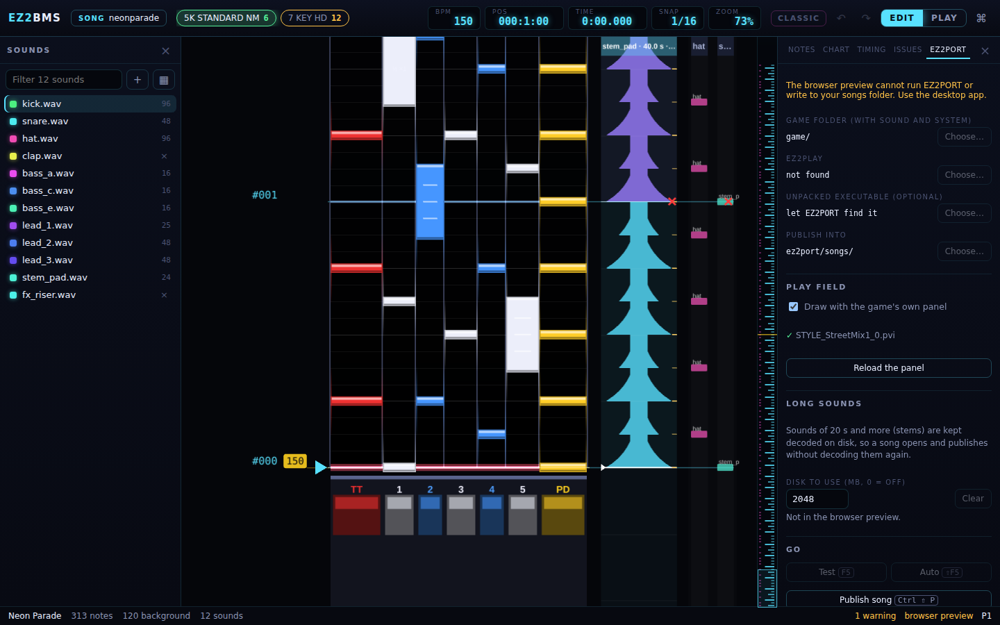

# EZ2PORT setup

This chapter covers the **EZ2PORT** tab: where you tell EZ2BMS about your game folder and
EZ2PORT, how the play field is drawn, and the disk cache for long sounds. You set it up once; EZ2BMS
remembers it.

## Opening the EZ2PORT tab

The EZ2PORT tab is the last tab of the right drawer. To open it, click **EZ2PORT** at the top of the
drawer, or press <kbd>Ctrl</kbd>+<kbd>K</kbd> and run **EZ2PORT settings**. EZ2BMS also opens it
for you when you press <kbd>F5</kbd> before your game folder is set.

Setting folders and running EZ2PORT need the desktop app. In the browser preview the tab says
**The browser preview cannot run EZ2PORT or write to your songs folder. Use the desktop app.** and
its **Choose…** buttons are turned off.

## Your folders

The top of the tab has four places. Each shows the path in use, and a **Choose…** button to change
it.

### Game folder (with sound and system)

Your EZ2AC data folder: the folder that has the `sound` and `system` folders in it. Choose the
folder itself, not one of those two inside it.

EZ2BMS reads your own game data from here, and nothing from the game ships with it. The game folder
is what lets EZ2BMS:

- draw the play field with the game's own panel and note art;
- use your EZ2PORT key settings (`ez2port/keys.ini` in the game folder) for test play;
- test your charts in EZ2PORT;
- import the game's own songs, and export songs back to the cabinet.

Until you choose one, it says **not set**.

### ez2play

EZ2PORT's player program (`ez2play.exe` on Windows, `ez2play` on Linux). EZ2BMS runs it when you
test a chart with <kbd>F5</kbd>.

When `ez2play` sits directly in your game folder, EZ2BMS finds it by itself. If yours is somewhere
else, click **Choose…** and pick it. Until it's found, this says **not found**.

If the file you pick isn't EZ2PORT's `ez2play`, a warning under it says so.

### Unpacked executable (optional)

Your unpacked EZ2AC executable. EZ2BMS reads the game's tables from it when it imports the game's
own songs and exports to the cabinet, and passes it to EZ2PORT when you test.

You can usually leave this alone: while it says **let EZ2PORT find it**, EZ2BMS looks for the
first `.exe` in your game folder that has the tables in it, as EZ2PORT does. Choose one only if
yours is elsewhere, or the wrong one is found.

### Publish into

The EZ2PORT songs folder that **Publish** writes your songs into. When you choose a game folder,
EZ2BMS fills this in with `ez2port/songs` inside it, EZ2PORT's usual place. Choose another folder
if your EZ2PORT keeps its songs elsewhere. Until there is one, it says **not set**; the Publish
dialog then asks you for it.

### How auto-detection works

EZ2BMS looks again each time it starts and each time you change one of these places:

- **ez2play** is filled in when it's in the game folder and you haven't chosen one;
- **Publish into** is filled in with the game folder's `ez2port/songs` when you haven't chosen
  one.

When you choose a **new game folder**, EZ2BMS clears **ez2play** and **Publish into** and detects
them again for the new folder, so the three always belong together. If you had chosen them by hand,
choose them again after changing the game folder.

## What this ez2play can do

Once EZ2BMS has found `ez2play`, the tab lists what that build of EZ2PORT supports, under
**This ez2play**: how many command-line options it has (and the source version it was built from,
when it says), and a checklist:

| Feature                              | What it gives you                                       |
| ------------------------------------ | ------------------------------------------------------- |
| **Private songs folder**             | Tests run on a private copy, not your songs folder      |
| **Log file**                         | EZ2PORT's output in the EZ2PORT log                     |
| **Test from the cursor (--start)**   | <kbd>F5</kbd> starts at the cursor instead of the start |
| **Skip READY (--no-ready)**          | The test starts without the READY screen                |
| **One window, reused (--viewer)**    | Tests reuse one EZ2PORT window                          |
| **Result back to EZ2BMS (--result)** | EZ2PORT's result is sent back to EZ2BMS                 |

A ✓ means the build has it. The first two are needed. The others are marked
**requested from EZ2PORT** when the build lacks them: they're features asked of EZ2PORT's
developers, and EZ2BMS uses them once a build has them.

## The play field

### Draw with the game's own panel

With **Draw with the game's own panel** ticked, EZ2BMS draws the play field with your game's own
lanes, note art, holds, beams, key panel and judgement line, read from your game folder. Untick it
to use EZ2BMS's own neon skin. The checkbox is turned off until you set a game folder. You can also
switch it with the **Game skin on / off** command.

The line under the checkbox says how it went:

- **✓** and the panel's file name when the panel was read. If some of its pictures weren't found
  in your game folder, it says how many; open **Not found** to see which.
- **No game folder set**, or **Off - drawing the neon skin** when the neon skin is used.
- **Reading the panel…** while it loads.
- An error followed by **- drawing the neon skin** when the panel couldn't be read, for example
  when the game folder has no panel file for this mode.

Click **Reload the panel** after changing files in your game folder, to read the panel again.

## Long sounds

Long sounds, 20 seconds and more (usually stems), take a while to decode. EZ2BMS keeps them decoded
on disk, so a song opens and publishes without decoding them again.

- **Disk to use (MB, 0 = off)** sets how much disk space the cache may take, in megabytes. The
  default is 2048 MB. Set it to 0 to turn the cache off.
- **Clear** empties the cache. Nothing is lost: sounds are decoded again the next time they're
  needed.
- The line underneath shows how many sounds are cached and how much space they use.

The cache lives in EZ2BMS's cache folder (shown in **About EZ2BMS**, see
[Preferences and help](17-preferences-and-help.md#about-ez2bms)). It isn't available in the browser
preview, which says **Not in the browser preview.**

## Go

The buttons at the bottom test and publish the chart you're editing:

- **Test** (<kbd>F5</kbd>) runs the chart in EZ2PORT for you to play;
- **Auto** (<kbd>Shift</kbd>+<kbd>F5</kbd>) runs it in EZ2PORT with autoplay;
- **Publish song** (<kbd>Ctrl</kbd>+<kbd>Shift</kbd>+<kbd>P</kbd>) opens the Publish dialog.

See [Publishing and testing](14-publish-and-test.md).

Next: [Charting](06-charting.md)
