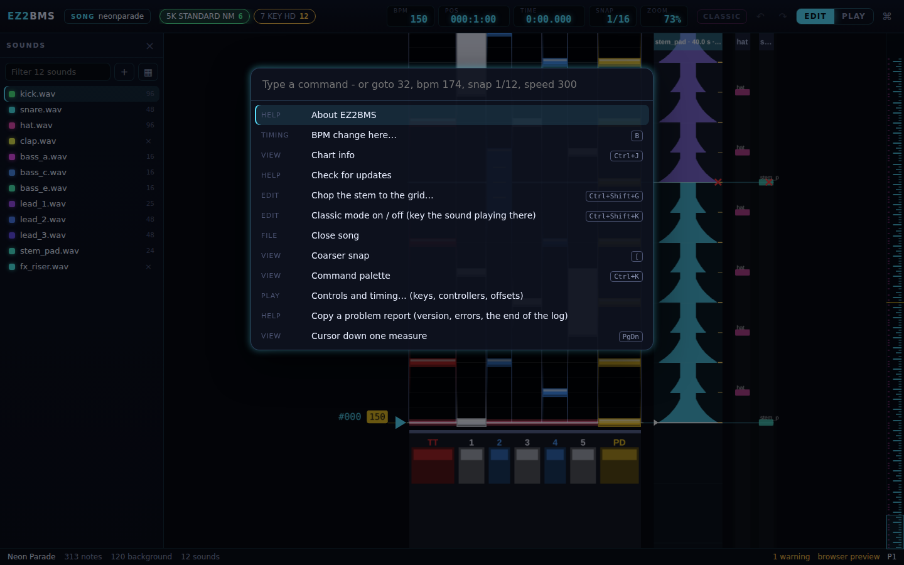

# Charting

This chapter covers placing and editing notes: the three tools, what the mouse and keyboard do on
the playfield, holds, snap, step input, mirroring, the clipboard, and the command palette. It also
covers zoom, speed and switching between charts. On macOS, Ctrl is Cmd.

## The tools

The editor has three tools. Press a key to switch, or pick one from the
[command palette](#the-command-palette).

| Tool   | Key          | What it is for                                                           |
| ------ | ------------ | ------------------------------------------------------------------------ |
| Draw   | <kbd>D</kbd> | Placing notes. This is the tool you start with.                          |
| Select | <kbd>V</kbd> | Selecting notes with a rubber band. A drag on empty space selects.       |
| Knife  | <kbd>C</kbd> | Cutting stems into slices. See [Slicing stems](09-slicing.md#the-knife). |

Most mouse actions work the same with the Draw and Select tools. The difference is what a drag
on an empty spot does: with Draw it places a note, with Select it draws a rubber band.

## Picking a sound to draw with

Every note plays a sound. The sound new notes get is the _brush_. To pick it, click a sound in the
**Sounds** drawer on the left (<kbd>Ctrl</kbd>+<kbd>B</kbd> shows or hides it). The picked sound
is highlighted. See [Sounds](08-sounds.md) for more ways to pick one.

To take the sound of a note that is already on the field, <kbd>Alt</kbd>-click the note. A message
confirms it, for example "Brush: kick.wav".

If no sound is picked, a click on a lane says **Pick a sound to draw with first (Sounds, on the
left)**.

## Using the mouse

### Placing a note

With the Draw tool, click a lane. A ghost note shows where the note will land before you click,
snapped to the grid. The new note plays its sound when you place it.

To make a hold (a long note), press on the lane and drag upwards, then let go where the hold should
end.

If a note can't go there, for example because it would overlap another note on the same lane, the
editor tells you why and places nothing.

### Selecting notes

- Click a note to select it. The note plays its sound.
- <kbd>Shift</kbd>-click or <kbd>Ctrl</kbd>-click a note to add it to the selection, or to take it
  out again.
- <kbd>Shift</kbd>-drag from an empty spot to draw a rubber band. With the Select tool, a plain
  drag on an empty spot does the same.
- <kbd>Ctrl</kbd>+<kbd>A</kbd> selects every note, and <kbd>Esc</kbd> selects nothing.

### Moving notes

Drag a note to move it, together with the rest of the selection. Notes move in time and across
lanes, snapped to the grid. Hold <kbd>Alt</kbd> while dragging to move freely, without snapping.

- Drag a lane note onto the background rack (the columns to the right of the lanes) to send it to
  the background, where it plays by itself.
- Drag a single background sound onto a lane to turn it into a note there.

### Changing a hold's length

Drag the end of a hold up or down. Snapping works the same as for moving, including
<kbd>Alt</kbd> to go off the grid.

### Erasing

Right-drag across notes to erase everything the pointer touches. If you right-click one note of a
selection of several, the whole selection is erased.

<kbd>Delete</kbd> or <kbd>Backspace</kbd> deletes the selected notes.

### Cancelling a drag

Press <kbd>Esc</kbd> during a move, a resize or an erase to put everything back as it was. When you
finish a drag, the whole drag is one undo step.

### Scrolling with the mouse

- The mouse wheel scrolls through the chart.
- A middle-button drag pans the chart.
- <kbd>Shift</kbd>+wheel over the background rack scrolls the rack sideways, when it is wider than
  the space it has.
- <kbd>Ctrl</kbd>+wheel zooms (see [Zoom, speed and scrolling](#zoom-speed-and-scrolling)).

## Holds

A hold is a note you keep pressed. You can make one by dragging up when you place it, or turn
existing notes into holds:

- Select one or more notes and press <kbd>L</kbd> (**Long note on/off**). Taps become holds one beat
  long, and if every selected note is already a hold, they become taps again. If a hold would cover
  another note, the editor says **A hold there would cover another note** and changes nothing.
- Drag the end of a hold to change its length.

### Hold kinds

EZ2 holds come in several kinds, which differ in how often the game judges them while you hold
(each judgement is an _instalment_) and what they pay. Select holds and press <kbd>K</kbd>
(**Next hold kind**) to step through the common kinds:

- every 1/4 beat (default)
- every 1/2 beat
- every 1/8 beat
- every 1/16 beat
- once, after the end (counted as 1/32s: never 100%)
- nothing while held

A hold that pays once after its end shows a small **end** tag on the field. The **Notes** tab
of the right drawer shows the kind of the selected holds, with every kind EZ2 has, and how many
times they are judged. See [Chart info, notes and issues](12-chart-info-and-issues.md).

## Snap

Everything you place or move snaps to the grid. The grid is shown in the top bar as **SNAP**, for
example 1/16. The grid sizes are divisions of a 4/4 measure: 1/4, 1/8, 1/12, 1/16, 1/24, 1/32,
1/48, 1/64, 1/96 and 1/192.

- <kbd>]</kbd> makes the snap finer.
- <kbd>[</kbd> makes the snap coarser.
- In the command palette, type `snap 1/12` (or `snap 12`) to go straight to a grid.

Hold <kbd>Alt</kbd> while you place, move or resize to ignore the grid.

## Moving the cursor

The cursor is the line where playback starts and where pasted notes, BPM changes and step input
go.

| Keys                       | Moves the cursor           |
| -------------------------- | -------------------------- |
| <kbd>Up</kbd>              | Up one snap                |
| <kbd>Down</kbd>            | Down one snap              |
| <kbd>PageUp</kbd>          | Up one measure             |
| <kbd>PageDown</kbd>        | Down one measure           |
| <kbd>Home</kbd>            | To the start               |
| <kbd>End</kbd>             | To the last note           |
| `goto 32` (in the palette) | To the start of measure 32 |

## Step input

Step input lets you place notes with the game keys instead of the mouse: each key you press puts a
note on its lane at the cursor. It is handy for typing in a pattern one step at a time.

1. Press <kbd>Ctrl</kbd>+<kbd>E</kbd> to turn step input on. With the default bindings, a message
   says **Step input on: Z S X D C V B, Shift, Space place notes at the cursor**.
1. Press a game key. A note appears on that key's lane at the cursor, snapped to the grid, with the
   picked sound. If a note is already there, the key removes it instead.
1. Move the cursor with <kbd>Up</kbd> and <kbd>Down</kbd> (one snap) and keep going.
1. Press <kbd>Ctrl</kbd>+<kbd>E</kbd> again to turn it off.

Step input uses your own bindings from the Controls dialog, so it works with a controller too. See
[Controllers and timing](11-controllers.md).

While step input is on, a bound key belongs to the game. With the default bindings, for example,
<kbd>D</kbd>, <kbd>C</kbd>, <kbd>V</kbd>, <kbd>S</kbd> and <kbd>B</kbd> place notes instead of
switching tools or adding a STOP or a BPM change, and <kbd>Space</kbd> places a pedal note instead
of starting playback. Presses with <kbd>Ctrl</kbd> or <kbd>Alt</kbd> are never taken, so
shortcuts such as <kbd>Ctrl</kbd>+<kbd>E</kbd> keep working.

## Mirror, lane moves and swapping sides

These act on the selected notes.

| Keys                            | What it does                 |
| ------------------------------- | ---------------------------- |
| <kbd>M</kbd>                    | **Mirror keys**              |
| <kbd>Alt</kbd>+<kbd>Left</kbd>  | **Move one lane left**       |
| <kbd>Alt</kbd>+<kbd>Right</kbd> | **Move one lane right**      |
| <kbd>Alt</kbd>+<kbd>Up</kbd>    | **Move later by one snap**   |
| <kbd>Alt</kbd>+<kbd>Down</kbd>  | **Move earlier by one snap** |
| <kbd>Ctrl</kbd>+<kbd>M</kbd>    | **Swap 1P / 2P**             |

**Mirror keys** flips the keys within each group of five: keys 1 and 5 trade places, 2 and 4 trade
places, and 3 stays. Turntables, pedals and effector lanes don't move, so in 7 KEY, keys 6 and 7
stay where they are.

**Swap 1P / 2P** moves notes to the other player's side: keys, turntable and pedal, and the
effector pairs (E1 with E3, E2 with E4).

If a change would put two notes in one place, nothing moves and the editor says so, for example
**Mirroring would put two notes in one place**.

<kbd>Alt</kbd>+<kbd>Left</kbd> and <kbd>Alt</kbd>+<kbd>Right</kbd> follow the screen: after
<kbd>F2</kbd> (**Swap P1 / P2 view**) they still move notes the way the arrow points.

## Copy, cut, paste and duplicate

| Keys                         | What it does                               |
| ---------------------------- | ------------------------------------------ |
| <kbd>Ctrl</kbd>+<kbd>C</kbd> | Copy the selected notes                    |
| <kbd>Ctrl</kbd>+<kbd>X</kbd> | Cut the selected notes                     |
| <kbd>Ctrl</kbd>+<kbd>V</kbd> | Paste at the cursor (snapped to the grid)  |
| <kbd>Ctrl</kbd>+<kbd>D</kbd> | Duplicate the selection right after itself |

Pasted notes keep their lanes and their sounds. You can also paste into another chart of the song,
even one in another mode: a note whose lane that mode doesn't have goes to the lane in the same
column position, or to the background when there is none. If pasted notes would overlap notes already there, the editor says
**Can't paste here: notes would overlap** and pastes nothing.

## Undo and redo

Every change is a step you can undo.

- <kbd>Ctrl</kbd>+<kbd>Z</kbd> undoes the last step.
- <kbd>Ctrl</kbd>+<kbd>Shift</kbd>+<kbd>Z</kbd> or <kbd>Ctrl</kbd>+<kbd>Y</kbd> redoes it.
- The arrow buttons in the top bar do the same.

The status bar names the last step, for example "last: Move note". Each chart keeps its own undo
history.

## The command palette

Every action in EZ2BMS is a command, and the command palette finds any of them by name. It is the
quickest way to reach something that has no key.

1. Press <kbd>Ctrl</kbd>+<kbd>K</kbd>, or click the ⌘ button at the right of the top bar.
1. Type part of a command's name. The list shows each match with its group and its keys, if it has
   any.
1. Use <kbd>Up</kbd> and <kbd>Down</kbd> to pick one, and press <kbd>Enter</kbd> to run it.
   <kbd>Esc</kbd> closes the palette.

Only commands you can use right now are listed. English command names always work, even when the
editor shows another language.

### Commands that take a value

Some commands take a value, typed after a short word (a _verb_). For example, type `bpm 174` and
press <kbd>Enter</kbd> to set the tempo at the cursor to 174 BPM.

| Type         | What it does                                                                    |
| ------------ | ------------------------------------------------------------------------------- |
| `goto 32`    | Moves the cursor to measure 32.                                                 |
| `bpm 174`    | Sets a BPM change at the cursor. `bpm -` removes it. BPM is between 0 and 1000. |
| `stop 96`    | Sets a STOP of 96 pulses at the cursor. `stop 0` removes it.                    |
| `scroll 1.5` | Sets a scroll speed change at the cursor. `scroll -` removes it.                |
| `snap 1/12`  | Sets the snap grid.                                                             |
| `speed 250`  | Sets the Play view speed, 50-999 %, in steps of 25.                             |

If you choose a command with a verb from the list without typing a value, the palette fills in the
verb for you to finish. <kbd>B</kbd> and <kbd>S</kbd> open the palette with `bpm` or `stop`
already typed. See [Timing](07-timing.md) for what BPM changes, STOPs and scroll changes do.

A value the command can't take is refused with a short reason, for example
**speed is 50-999 %**.

## Zoom, speed and scrolling

The editor has two views: **EDIT**, where you chart, and **PLAY**, where the chart scrolls as it
does in the game. <kbd>Tab</kbd> switches between them, or click **EDIT** or **PLAY** in the top
bar. See [Playing and recording](10-play-and-record.md) for the Play view.

- In the Edit view, zoom with <kbd>Ctrl</kbd>+<kbd>=</kbd> and <kbd>Ctrl</kbd>+<kbd>-</kbd>, or
  <kbd>Ctrl</kbd>+wheel. The top bar shows it as **ZOOM**.
- In the Play view, the same keys change the scroll speed in steps of 25 %, and the top bar shows
  **SPEED**. Type `speed 250` in the palette to set it directly; the palette's value is remembered.
- <kbd>F2</kbd> (**Swap P1 / P2 view**) shows the lanes as the 2P side sees them.

## Switching charts

A song can have several charts, one for each mode and difficulty. The top bar shows them as tabs
next to **SONG**, each with its mode and level. A dot on a tab means the chart has unsaved changes.

Click a tab to switch, or press <kbd>Ctrl</kbd>+<kbd>1</kbd> to <kbd>Ctrl</kbd>+<kbd>9</kbd> for
the first nine charts. <kbd>Ctrl</kbd>+<kbd>N</kbd> makes a new chart; see
[The song manager](13-song-manager.md).

For every key in one table, see the [shortcuts](../keybindings.md).

Next: [Timing](07-timing.md)
