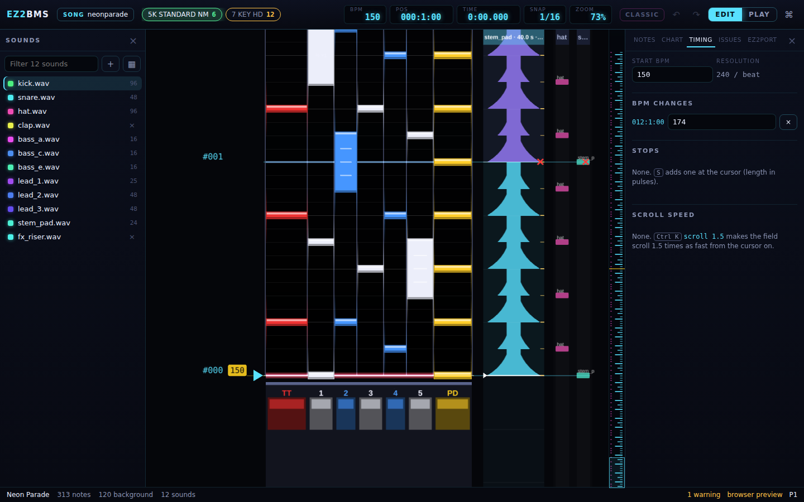

# Timing

This chapter covers the chart's tempo and scroll: the start BPM, BPM changes, STOPs and scroll
speed changes, all on the **Timing** tab of the right drawer. On macOS, Ctrl is Cmd.

## Opening the Timing tab

Press <kbd>Ctrl</kbd>+<kbd>T</kbd>, or click **Timing** at the top of the right drawer. Press
<kbd>Ctrl</kbd>+<kbd>T</kbd> again to close the drawer.

The tab lists everything in chart order. Each entry starts with its position (measure, beat and
step, as the top bar's **POS** shows it). Click a position to move the cursor there.

Every change you make on this tab is an undo step, like any other edit.

## Start BPM and resolution

**Start BPM** is the tempo the chart starts at. Type a new value to change it. To take the tempo
from the music itself, use a stem's tempo detection; see
[Slicing stems](09-slicing.md#finding-the-tempo).

**Resolution** shows how finely the chart divides a beat, in pulses per beat (for example 240 /
beat). You can't change it here. It limits which snap grids the chart can use exactly, and a STOP's
length is counted in these pulses.

## BPM changes

A BPM change sets a new tempo from its position on.

To add one:

1. Put the cursor where the tempo changes.
1. Press <kbd>B</kbd> (**BPM change here…**). The command palette opens with `bpm` typed for you.
1. Type the tempo, for example `bpm 174`, and press <kbd>Enter</kbd>.

The change goes on the snap grid nearest the cursor. A BPM is between 0 and 1000. A change at the
very start of the chart sets the start BPM instead.

Under **BPM changes**, type in an entry's box to change its tempo, or click its **×** to remove it.
In the palette, `bpm -` removes the change at the cursor. When the chart has none, the tab says
**None. B adds one at the cursor.**

## STOPs

A STOP holds the scroll still for a while at its position. Its length is counted in pulses (see
[Start BPM and resolution](#start-bpm-and-resolution)): with 240 pulses a beat, `stop 240` holds
for one beat.

To add one:

1. Put the cursor where the scroll should stop.
1. Press <kbd>S</kbd> (**STOP here…**). The palette opens with `stop` typed.
1. Type the length, for example `stop 240`, and press <kbd>Enter</kbd>.

Under **STOPs**, change an entry's length in its box, or click its **×** to remove it. `stop 0`
removes the STOP at the cursor.

EZ2 itself has no STOP. When a chart has STOPs, the tab warns you: **EZ2 has no STOP: EZ2PORT gets a
gap in time instead, so the scroll does not freeze.** The notes still come at the same
times, but in the game the field keeps moving through the pause instead of freezing.

## Scroll speed changes

A scroll speed change makes the field scroll faster or slower from its position on, without
changing when anything plays. It is a multiplier on the player's own speed: 1.5 scrolls one and a
half times as fast, 0.5 half as fast. In EZ2PORT the scroll eases to the new speed over a few
frames, and every note on the field moves with it.

To add one, put the cursor where it starts, open the command palette with
<kbd>Ctrl</kbd>+<kbd>K</kbd>, type `scroll 1.5` and press <kbd>Enter</kbd>. You can also write the
value as `x1.5` or `150%`.

Under **Scroll speed**, change an entry's multiplier in its box, or click its **×** to remove it.
`scroll -` removes the change at the cursor.

## Records kept from a game chart

A chart imported from the game can hold records that the editor's chart format has no place for.
EZ2BMS keeps them so that a cabinet export can write them back where they were. They show under
**From the game chart**, with their count, at the end of the tab. Click the heading to open the
list.

These records are read-only here. Each one shows its position, what it is, and the game chart's
track it sits on. They play no part in the editor or in EZ2PORT; only a cabinet export uses them.
On the playfield, a small grey tag beside the lanes marks where they are. Point at it to read them.

If the chart was imported by an older version of EZ2BMS, the tab may say that more records were
kept from the game chart. Those do play and publish. The **Issues** tab offers to turn them into
scroll speed changes you can edit on this tab. See
[Chart info, notes and issues](12-chart-info-and-issues.md) and [Importing](15-import.md).

Next: [Sounds](08-sounds.md)
