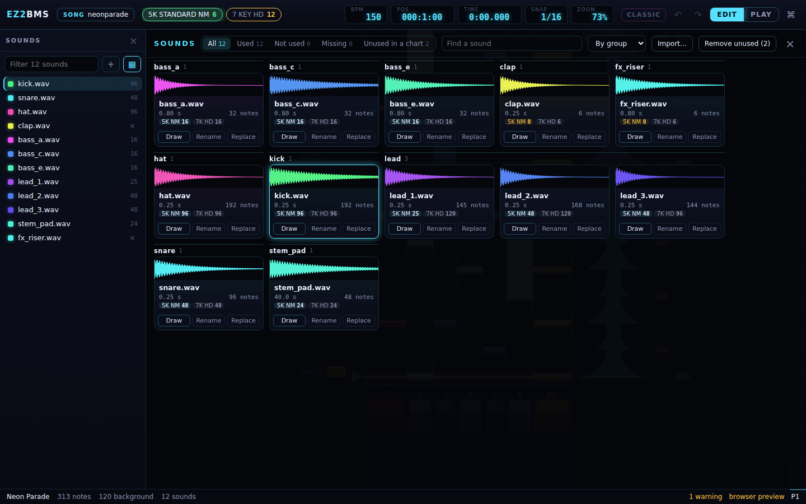

# Sounds

This chapter covers the sounds your notes play: the **Sounds** drawer beside the playfield, the
keysound workbench that shows every sound of the song, Classic mode for charting music that is
already complete, and dropping files on the window. On macOS, Ctrl is Cmd.

## The Sounds drawer

The **Sounds** drawer on the left lists the sounds of the open chart. It is where you pick the
sound new notes are drawn with (the _brush_). Press <kbd>Ctrl</kbd>+<kbd>B</kbd> (**Show / hide
sounds**) to show or hide it, or click its **×** to close it.

### Picking and hearing a sound

- Click a sound to draw with it. The picked sound is highlighted.
- Click the coloured square in front of a name to hear the sound. A square with red stripes is a
  sound that could not be read; point at it to see why.
- The number at the end of a row is how many notes play that sound in this chart.

You can also pick a sound from the field: <kbd>Alt</kbd>-click a note to draw with its sound. See
[Charting](06-charting.md#picking-a-sound-to-draw-with).

### Finding a sound

Type in the filter box at the top (**Filter _n_ sounds**) to show only the sounds whose names
contain what you type. The drawer lists up to 400 sounds at once; if there are more, it says so and
the filter finds the rest.

### Renaming and removing

- Double-click a sound to rename it, then press <kbd>Enter</kbd> (or <kbd>Esc</kbd> to cancel).
  This changes the file name this chart's sound plays. It does not rename the file on disk; to
  rename a file, use **Rename** in the [workbench](#the-keysound-workbench).
- A sound no note plays has a **×** instead of a count. Click it (**Remove (unused)**) to remove the
  sound from this chart's list. The file stays in the song folder.

### Adding sounds from the song folder

Sound files in the song folder that this chart doesn't use yet are listed below, under **In the
folder, not in this chart**. Click one to add it to the chart, or click **Add all**.

### Importing sound files

To bring in sounds from elsewhere, click the **+** button next to the filter box, pick the files,
and confirm. You can also drop files on the window (see [Dropping files](#dropping-files)).

EZ2BMS copies the files into the song folder and adds them to the open chart. WAV, OGG, FLAC and
MP3 files can be imported. Nothing in the folder is ever overwritten: a file that is already there
with the same name and the same content is simply reused. A message says what was imported, what
was added to the chart, and what was skipped and why.

The **▦** button next to **+** opens the keysound workbench.

## The keysound workbench

The keysound workbench shows every sound of the song at once, across all its charts, with a
waveform for each. Use it to see which sounds are used where, to find sounds that are missing or
unused, and to rename or replace a sound everywhere at once.

Press <kbd>Ctrl</kbd>+<kbd>Shift</kbd>+<kbd>B</kbd> (**Keysound workbench**) or click **▦** in the
Sounds drawer to open it over the playfield. Press <kbd>Esc</kbd> or click its **×** to close it.

### Finding sounds

Along the top of the workbench:

- The filters show **All** sounds, the **Used** ones, those **Not used** by any chart, those
  **Missing** from the song folder, and sounds that are **Unused in a chart** (in a chart's list,
  but playing no note there). Each filter shows how many sounds it has.
- **Find a sound** filters by name.
- The order menu sorts **By group** (sounds named alike together, such as `lead_1.wav` and
  `lead_2.wav`), **By name**, **Most used** or **Longest**.
- **Import…** copies sound files into the song, as in the Sounds drawer.
- **Remove unused (_n_)** removes every sound that plays no note from each chart's list. The files
  stay on disk.

### Reading a card

Each sound is a card:

- The waveform. Click it to hear the sound. A tag on it says when a sound is **missing** from the
  folder, when EZ2BMS **can't read** it, or when it is **not used**.
- The file name, its length and how many notes play it.
- A chip for each chart that uses it, with its mode, tier and note count. Point at a chip to see
  how many of those notes are on lanes and how many are in the background.

The card of the sound you are drawing with is highlighted.

### Drawing, renaming and replacing

Each card has three buttons:

- **Draw** picks the sound as the brush in the open chart and closes the workbench. If the chart
  doesn't have the sound yet, it is added.
- **Rename** renames the file on disk and every chart's reference to it. Type the new name and
  press <kbd>Enter</kbd>. Charts that had no unsaved changes are saved at once, so the song folder
  stays consistent. A rename is not an undo step; instead, the message that follows has an
  **Undo** button that renames the file back.
- **Replace** makes another file play wherever this sound plays, in every chart. A dialog opens
  (**Play instead of _sound_**): find the file and click it, or click **Cancel**. The replacement is
  one undo step in each chart it changes, and the message that follows offers **Undo in all
  charts**.

**Remove unused** also offers **Undo in all charts**.

### Other sound commands

Two more commands are in the [command palette](06-charting.md#the-command-palette):

- **Reload sound files (after editing them in another program)**
- **Remove unused sounds from every chart**, the same as the workbench's **Remove unused** button.

## Classic mode

Classic mode is for songs whose music is already complete in the background, such as a converted
BMS or a set of stems cut into slices. In such a song, charting means moving what is already
playing onto the lanes, so that the player's key plays exactly the sound that would have played
there anyway.

In Classic mode, placing a note _keys_ the sound playing at that spot instead of using the picked
sound. None of it ever changes how the song sounds on autoplay: EZ2BMS checks every Classic edit
before it makes it, and refuses one that would change the sound, with the reason.

### Turning Classic mode on

Press <kbd>Ctrl</kbd>+<kbd>Shift</kbd>+<kbd>K</kbd>, or click **CLASSIC** in the top bar. A message
says **Classic mode: placing a note keys the sound playing there**, and the status bar shows
**CLASSIC**. Press it again to turn it off.

Classic mode is a setting of the song, saved with it. A song whose charts already have sliced
sounds starts with it on.

### Keying a note

1. Point at a lane where something plays in the background. A label by the pointer, and in the
   status bar, names the sound a note there would key. When several sounds could be keyed, it shows
   which one of them, for example `pad.wav (2/3)`. The label ends in **· slice** when keying cuts a
   sound that is playing through, and in **- would change the sound** when that choice is refused.
1. Press <kbd>Q</kbd> (**Classic: next sound to key**) or <kbd>Shift</kbd>+<kbd>Q</kbd>
   (**Classic: previous sound to key**) to choose another one. While you are dragging out a note,
   <kbd>Tab</kbd> and <kbd>Shift</kbd>+<kbd>Tab</kbd> do the same.
1. Click to place the note. You hear the sound it keys.

Keying either moves a background note that starts right there onto the lane, or cuts a sound that
is playing through at that spot, so that the rest of it plays from the lane.

While Classic mode is on, a note you place snaps to the notes of the picked sound's group before
it snaps to the grid.

### Other edits in Classic mode

- <kbd>Delete</kbd> un-keys the selected notes: their sounds go back to the background.
- Right-clicking a lane note un-keys it. Right-clicking a cut in the background heals it, and
  right-clicking where a sound plays through cuts it there. Classic mode never removes a sound, so
  right-clicking where a sound starts only says so.
- Dragging moves notes between lanes and the background, but never in time.
- **Classic: reset all notes to the background** (in the command palette) sends every note on a
  lane back to the background. It asks first; click **Reset** to go ahead.

For recording in a Classic song, see [Playing and recording](10-play-and-record.md#recording).

## Dropping files

You can drag files from your file manager onto the EZ2BMS window. While they are over the window, a
card says what will happen when you let go, and the files are then imported:

- **Sound files, or folders of them**, are copied into the song folder and added to the open chart,
  as the **+** button does.
- **Images** (PNG, JPEG, BMP), dropped while the song manager shows the title plate or the art
  page, are copied into the song folder for the disc and the eyecatch. See
  [The song manager](13-song-manager.md).
- **A movie**, dropped while the song manager shows the BGA page, is copied into the song folder
  and becomes the BGA.
- **A BMS file** opens the import wizard with that song. See [Importing](15-import.md).

Nothing in the song folder is overwritten.

Next: [Slicing stems](09-slicing.md)
