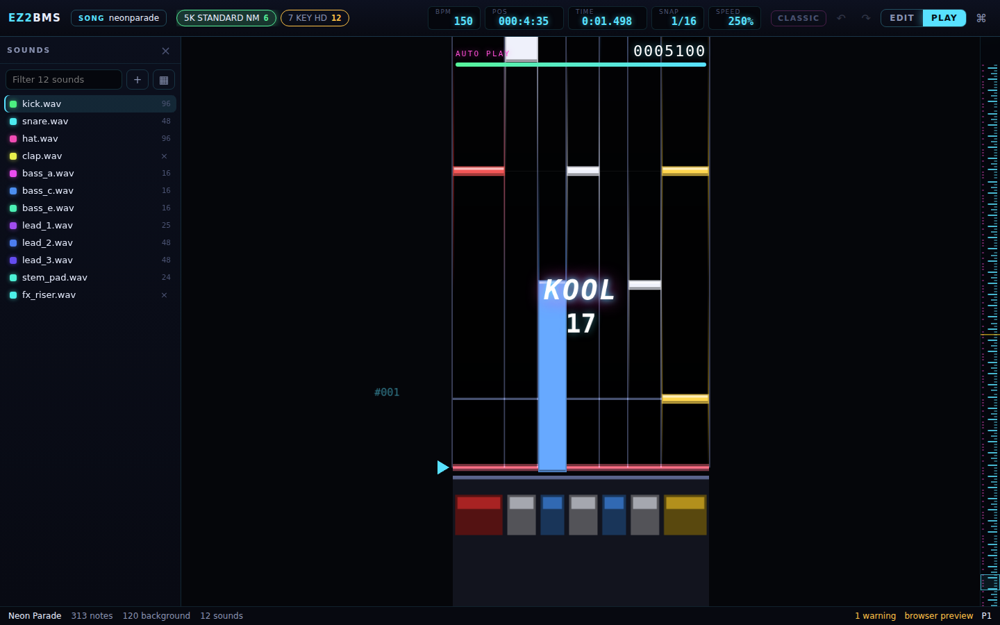

# Playing and recording

This chapter covers listening to your chart, watching it in the Play view, test playing it with
your own keys and judgements like EZ2PORT's, and recording notes by playing along. On macOS, Ctrl
is Cmd.

## Listening to the chart

Playback plays the chart as EZ2PORT will sound it, from the cursor. The cursor follows the music
while it plays.

| Keys                                          | What it does                                         |
| --------------------------------------------- | ---------------------------------------------------- |
| <kbd>Space</kbd>                              | **Play / stop from the cursor**                      |
| <kbd>Shift</kbd>+<kbd>Space</kbd>             | **Play again from where playback last started**      |
| <kbd>Ctrl</kbd>+<kbd>Shift</kbd>+<kbd>M</kbd> | **Mute / unmute background sounds**                  |
| <kbd>Ctrl</kbd>+<kbd>Shift</kbd>+<kbd>S</kbd> | **Solo the lane under the pointer (again to clear)** |

When you stop, the cursor stays where playback got to. <kbd>Shift</kbd>+<kbd>Space</kbd> jumps back
to where you last started and plays from there again, which is handy for listening to one passage
over and over while you edit it. Playback stops by itself a moment after the chart's end.

### Muting the background

<kbd>Ctrl</kbd>+<kbd>Shift</kbd>+<kbd>M</kbd> silences every background sound, so you hear only
the notes on the lanes. A message says **Background muted**; press it again for
**Background on**.

### Soloing a lane

Point at a lane and press <kbd>Ctrl</kbd>+<kbd>Shift</kbd>+<kbd>S</kbd>. Only that lane's notes play
among the lanes, and a message says which, for example **Solo: lane 3**. The background still plays
unless you mute it too. Press <kbd>Ctrl</kbd>+<kbd>Shift</kbd>+<kbd>S</kbd> again to clear it
(**Solo off**).

## The Play view

The Play view shows the chart as it scrolls in the game, at the game's speed. Press
<kbd>Tab</kbd>, or click **PLAY** in the top bar, to switch to it; press <kbd>Tab</kbd> again or
click **EDIT** to go back.

In the Play view:

- <kbd>Space</kbd> starts autoplay from the cursor: every note is hit as KOOL, with the judgements
  and the HUD shown as in the game. **AUTO PLAY** shows over the field. Press <kbd>Space</kbd> or
  <kbd>Esc</kbd> to stop it.
- The scroll speed shows in the top bar as **SPEED**. Change it with <kbd>Ctrl</kbd>+<kbd>=</kbd>
  and <kbd>Ctrl</kbd>+<kbd>-</kbd> (steps of 25 %), <kbd>Ctrl</kbd>+wheel, or `speed 250` in the
  [command palette](06-charting.md#the-command-palette). It goes from 50 % to 999 %, as on the
  cabinet.
- If you set a game folder, **Game skin on / off** in the palette draws the field with the game's
  own panel. See [Setting up EZ2PORT](05-ez2port-setup.md).

## Test play

Test play lets you play the chart yourself, on the keyboard or a controller, judged the way EZ2PORT
judges it. It uses the chart's own judgement and gauge settings from the **Chart** tab (see
[Chart info, notes and issues](12-chart-info-and-issues.md)).

1. Put the cursor where you want to start.
1. Press <kbd>Shift</kbd>+<kbd>Tab</kbd> (**Test play from the cursor (your keys, judged like
   EZ2PORT)**). The editor switches to the Play view, and the chart starts one beat before the
   cursor. **TEST PLAY** shows over the field.
1. Play with your game keys. With the default bindings these are
   <kbd>Z</kbd> <kbd>S</kbd> <kbd>X</kbd> <kbd>D</kbd> <kbd>C</kbd> for keys 1 to 5, the left
   <kbd>Ctrl</kbd> and <kbd>Shift</kbd> for the turntable and <kbd>Space</kbd> for the pedal. See
   [Controllers and timing](11-controllers.md#the-default-game-keys) for the full layout and for
   binding your own keys or a controller.
1. Press <kbd>Esc</kbd>, or <kbd>Shift</kbd>+<kbd>Tab</kbd> again, to end the run early. Otherwise it
   ends with the chart.

As on the cabinet, the background plays by itself, but a lane's sound plays only when you press
its key. A press plays the lane's nearest sound whether or not it hits, and a note you miss is
silent. In SCRATCH (ScratchMix) charts, the turntable strums the keys you hold, as it does in
EZ2PORT.

While you test play, your bound keys belong to the game. With the left <kbd>Ctrl</kbd> as the
turntable, for example, <kbd>Ctrl</kbd>+<kbd>Z</kbd> is a key press and a scratch, not an undo.

### The HUD

During autoplay and test play, the HUD over the field shows:

- **AUTO PLAY** or **TEST PLAY**, and the score;
- the gauge, as a bar;
- the last judgement (KOOL, COOL, GOOD, FAIL or MISS). Under any judgement other than KOOL, **FAST**
  or **SLOW** says whether you were early or late;
- the combo, from two notes on.

### The result card

When a run ends, the result card shows it the way the cabinet's result screen does: the song
title, the chart and its level, the grade, the score and rate, and **CLEAR**, **FAILED** or, when
you ended the run early, **STOPPED**. It also counts each judgement and shows **MAX COMBO**,
**NOTES** and **GAUGE**.

A run you stopped early is graded only on the notes played so far, and the card says so, for
example **graded on the 120 notes played**.

Click **Retry** (<kbd>Enter</kbd>) to start the same kind of run again from the cursor, or
**Close** (<kbd>Esc</kbd>) to put the card away.

If your presses seem to land early or late, calibrate the offsets first; see
[Calibration](11-controllers.md#calibration).

## Recording

Record mode lets you chart by playing along: you press the game keys while the song plays, and
your presses become notes. It uses the same keys and controllers as test play, and the offsets
from [calibration](11-controllers.md#calibration), so that what you play lands where you meant it.

Before you record in a normal song, pick the sound the new notes should play in the Sounds drawer.
Otherwise the editor says **Pick a sound to record with first (or turn Classic mode on)**.

### Recording a take

Press <kbd>R</kbd> in the editor. Recording goes through three stages:

1. **Count-in.** The chart starts some beats before the cursor (4 by default), with a click on
   every beat and the first beat of each bar accented. The panel over the field counts down.
   Presses during the count-in are not recorded.
1. **Recording.** Play along. The panel shows **REC** and the number of presses. Each press shows on
   the field straight away, snapped as it will land. Press <kbd>R</kbd> or <kbd>Esc</kbd> to stop.
   Recording also stops at the chart's end.
1. **Review.** The take stays on the field. The cursor goes back to where you started. Each note of
   the take is coloured by what it would become:
   - green: it will be placed (**_n_ to place**);
   - red: the lane already has a note there (**_n_ on notes already there**). A take never
     overwrites a note;
   - grey: in a Classic song, nothing is sounding there to key (**_n_ with nothing to key**).

In the review panel, choose what to do with the take:

- **Keep** (<kbd>Enter</kbd>) puts the take into the chart as one undo step and selects what it
  placed. A message says how many notes were placed and what was left out.
- **Retake** (<kbd>R</kbd>) throws the take away and records again from the same place.
- **Discard** (<kbd>Esc</kbd>) throws the take away.

The review panel also shows how your presses sat against the grid: the mean and the median, in
ms, and how many were early or late. If the mean and median are well away from zero, your latency
settings need adjusting; see [Calibration](11-controllers.md#calibration).

### What a press becomes

- **In a normal song**, a press is a note with the picked sound, and you hear that sound on its
  lane as you press.
- **In a song charted in Classic mode** (see [Classic mode](08-sounds.md#classic-mode)), a press
  keys the background sound playing at that spot: a note already there, or a cut of a sound that is
  playing through. The music stays exactly as it was: each keying is checked like a Classic edit
  and refused if it would change the sound. Only background sounds are taken, never another lane's.
  A press is silent while you record, because the music already has that sound. The review panel
  shows **Classic: keys what plays**.
- **In SCRATCH (ScratchMix) charts**, recording works as EZ2PORT plays: a key alone is nothing, the
  turntable strums the keys held on its side (and a key pressed just after a strum still counts),
  and every note is a tap, because the scratch game has no holds.

### Recording options

The options are in the review panel, and EZ2BMS remembers them.

| Option                             | Default | What it does                                                                                                                             |
| ---------------------------------- | ------- | ---------------------------------------------------------------------------------------------------------------------------------------- |
| **Holds from _n_ ms**              | 200 ms  | A press held at least this long becomes a hold, up to its snapped release. A hold that would swallow another note becomes a tap instead. |
| **Grid** / **EZ2 exact**           | Grid    | Snap presses to the editor's snap grid (<kbd>[</kbd> <kbd>]</kbd>), or to EZ2's own grid of 1/48 beat.                                   |
| **Count-in _n_ beats**             | 4       | How many beats before the cursor the chart starts.                                                                                       |
| **metronome**                      | off     | A click on every beat while you record.                                                                                                  |
| **mute the lanes while recording** | off     | The chart's own lane sounds are silent while you record. Not offered in Classic songs, where it would leave holes in the music.          |

Changing **Holds from** or the grid during review snaps the take again straight away. The other
options apply to the next take.

Next: [Controllers and timing](11-controllers.md)
