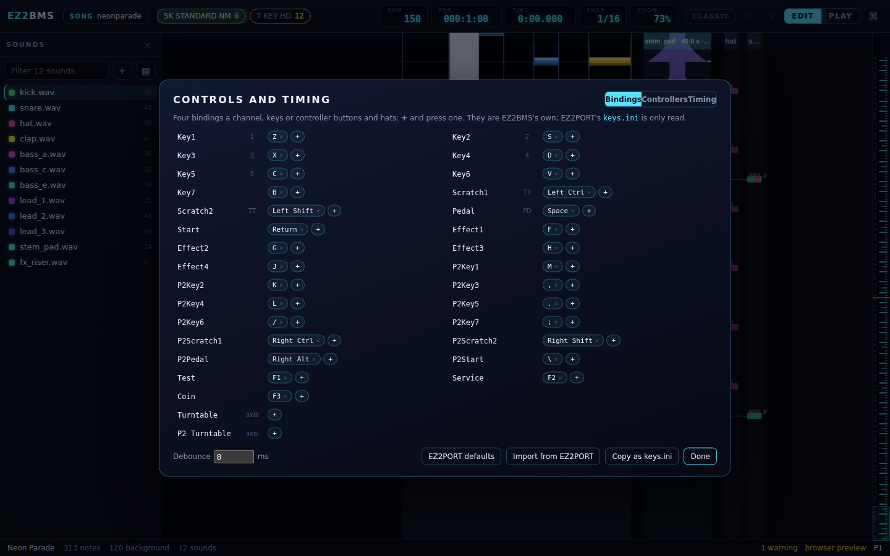

# Controllers and timing

This chapter covers the keys and controllers you play with in EZ2BMS, and how to measure your
machine's latency so that what you play lands where you meant it. It also covers the cabinet's HID
bridge and controller permissions on Linux. On macOS, Ctrl is Cmd.

Everything you play in EZ2BMS uses the same bindings and offsets: [test
play](10-play-and-record.md#test-play), [recording](10-play-and-record.md#recording),
[step input](06-charting.md#step-input) and the latency tests. EZ2PORT has its own settings; the
offsets here are for playing and recording in EZ2BMS only.

## The Controls dialog

Open the [command palette](06-charting.md#the-command-palette) with <kbd>Ctrl</kbd>+<kbd>K</kbd>
and run **Controls and timing… (keys, controllers, offsets)**. The **Controls and timing** dialog
has three tabs: **Bindings**, **Controllers** and **Timing**. Changes take effect at once. Click
**Done** or press <kbd>Esc</kbd> to close it.



## Bindings

The **Bindings** tab lists every control EZ2PORT knows, with what is bound to it. There are 29 of
them: Key1 to Key7, the scratch pair (Scratch1 and Scratch2), Pedal, Start, Effect1 to Effect4, the
same for player 2 (P2Key1 and so on), and Test, Service and Coin. Below them are the two turntables.

Next to each name, a short label says where the control plays in the open chart's mode, for example
**1** or **TT**. In SCRATCH (ScratchMix) charts, the scratch controls say **strum**. A row lights up
while its control is held down, which is a quick way to test a binding.

### Binding a key or a button

Each control takes up to four bindings: keyboard keys, controller buttons, or hat directions.

1. Click the **+** at the end of the row. It says **Press a key or button…**.
1. Press the key, or the button on your controller.

To give up, press <kbd>Esc</kbd> or click the waiting chip. To remove a binding, click the **×** on
its chip. A control that already has four bindings has no **+**; remove one first.

### Binding a turntable

The **Turntable** and **P2 Turntable** rows take a controller axis.

1. Click the **+** in the row. It says **Turn it…**.
1. Turn the turntable.

Once an axis is bound, two checkboxes appear:

- **reversed** flips its direction. In `keys.ini` this is written `:rev` after the axis.
- **speed, not position** is for an axis that reports how fast the turntable spins rather than
  where it is. In `keys.ini` this is written `,vel`.

You can instead bind the turntable's direction buttons to Scratch1 and Scratch2 (see
[The cabinet's HID bridge](#the-cabinets-hid-bridge)), but use one or the other, not both.

### Debounce

**Debounce _n_ ms**, at the bottom of the tab, is 8 ms by default, as in EZ2PORT. A second press or
release on a control within this time of the last one is taken as switch chatter, not as a press.

### Bindings and EZ2PORT's keys.ini

The bindings are EZ2BMS's own, written the way EZ2PORT's `keys.ini` file writes them, so they copy
between the two programs as they are.

The first time, EZ2BMS takes EZ2PORT's own `keys.ini` (and the **Debounce** from its
`settings.ini`), if it finds them, and keeps them as its own. It looks in these places, in order:

1. the file named by the `EZ2_KEYS` environment variable;
1. the `ez2port` folder of the game's data folder, on a cabinet where ez2play is in that folder (see
   [Setting up EZ2PORT](05-ez2port-setup.md));
1. EZ2PORT's settings folder for your user: `$XDG_CONFIG_HOME/ez2port` or `~/.config/ez2port`, or
   `%APPDATA%\ez2port` on Windows.

After that, the two sets of bindings are separate. The buttons at the bottom of the tab move them
across:

- **Import from EZ2PORT** takes EZ2PORT's file again.
- **Copy as keys.ini** puts EZ2BMS's bindings on the clipboard, in EZ2PORT's own layout, for you
  to paste into EZ2PORT's `keys.ini`. EZ2BMS never writes EZ2PORT's files.
- **EZ2PORT defaults** goes back to EZ2PORT's default keyboard layout (see below).

### The default game keys

These are EZ2PORT's default bindings, which EZ2BMS uses until you change them. Player 2's keys
mirror player 1's on the right-hand side of the keyboard.

| Control             | Player 1              | Player 2                |
| ------------------- | --------------------- | ----------------------- |
| Keys 1-7            | Z S X D C V B         | M K , L . / ;           |
| Scratch1, 2         | Left Ctrl, Left Shift | Right Ctrl, Right Shift |
| Pedal               | Space                 | Right Alt               |
| Start               | Return                | \\                      |
| Effect1-4           | F G H J               |                         |
| Test, Service, Coin | F1, F2, F3            |                         |

While something is listening for game keys (test play, recording, the latency tests), a bound key
belongs to the game: with the left Ctrl as the turntable, <kbd>Ctrl</kbd>+<kbd>Z</kbd> is Key1 and
a scratch, not an undo. Step input takes only presses without <kbd>Ctrl</kbd>, <kbd>Alt</kbd> or
the Windows or Command key, so shortcuts keep working around it.

## Controllers

Game controllers work in the desktop app only. EZ2BMS reads them the same way EZ2PORT does (both
use SDL 3), so a
controller has the same name and the same button, hat and axis numbers in both programs, and a
binding copied between them presses the same control.

The **Controllers** tab lists the controllers EZ2BMS has open, with a live readout of each one's
buttons, hats and axes. Press a button and watch its number appear, which tells you what to bind.
If nothing is connected, the tab says **No controller found. Plug one in: it shows here as soon as
it is seen.**

### How controllers are named

A controller is named by its make, as its USB vendor and product IDs in hexadecimal, for example
`0810:e501`. In a binding, a button is written after the name, such as `0810:e501/b3` for button 3.

A second controller of the same make is `0810:e501#1`, a third `#2`, in the order the system lists
them. So two identical controllers can swap names if they are listed the other way round, just as
they can in EZ2PORT. Plugging or unplugging a controller can renumber them.

A press is timed when the controller reported it, not when the editor got to it. As in EZ2PORT, a
press more than 200 ms old is taken as happening now.

### When controllers are open

EZ2BMS opens the controllers only while something needs them: test play, recording, the Controls
dialog, step input and the latency tests. It closes them for the whole of a **Test in EZ2PORT**
(<kbd>F5</kbd>) run.

This matters on Windows, where a controller like the cabinet's bridge can be open in only one
program at a time: a controller EZ2BMS holds is one the game can't read. If you start EZ2PORT
yourself, not with <kbd>F5</kbd>, while EZ2BMS is test playing or recording, the game can be left
without it. Stop those first.

### The cabinet's HID bridge

The EZ2 I/O bridge (`ez2-io`, with the `ez2_hid_bridge` firmware) makes the cabinet's controls one game controller with 32 buttons and
two axes. Its make is the board's: an Arduino Micro normally shows as `2341:8037` and a Leonardo as
`2341:8036`. The **Controllers** tab says which.

Button _N_ of the bridge is `/b(N-1)` in a binding:

| Bridge            | Binding        | Control                         |
| ----------------- | -------------- | ------------------------------- |
| Buttons 1-5       | `/b0`-`/b4`    | Key1-Key5                       |
| Buttons 6-10      | `/b5`-`/b9`    | P2Key1-P2Key5                   |
| 11, 12 (Start)    | `/b10`, `/b11` | Start, P2Start                  |
| 13-16 (effectors) | `/b12`-`/b15`  | Effect1-Effect4                 |
| 17, 18 (pedals)   | `/b16`, `/b17` | Pedal, P2Pedal                  |
| 19, 20            | `/b18`, `/b19` | Test, Service                   |
| 21, 22 (TT1 +/-)  | `/b20`, `/b21` | Scratch1, Scratch2 (pulses)     |
| 23, 24 (TT2 +/-)  | `/b22`, `/b23` | P2Scratch1, P2Scratch2 (pulses) |
| 25 (Coin)         | `/b24`         | Coin                            |
| X axis            | `/a0`          | Turntable                       |
| Y axis            | `/a1`          | P2Turntable                     |

For the turntables, bind either the axes or the pulse buttons, not both. With the axes, any
movement raises the scratch control for 90 ms, and turning back drops the other direction at once,
as EZ2PORT's analog turntable does.

The easiest way to set this up is to bind each control by pressing it in the **Bindings** tab.
Written as a `keys.ini`, the result looks like this:

```ini
[Keys]
Key1 = Z, 2341:8037/b0
Key2 = S, 2341:8037/b1
; ... and so on down the table
Pedal = Space, 2341:8037/b16
Effect1 = F, 2341:8037/b12

[Analog]
Turntable = 2341:8037/a0
P2Turntable = 2341:8037/a1
```

### Linux permissions

On Linux, controllers are read through `/dev/input/event*`, and for some boards also
`/dev/hidraw*`. Desktop systems usually let the logged-in user use joysticks. If the
**Controllers** tab stays empty, check the permissions of those device files, add yourself to the
`input` group, or give the board to the logged-in user with a udev rule. For example, create
`/etc/udev/rules.d/70-ez2-io.rules` with:

```
SUBSYSTEM=="input", ATTRS{idVendor}=="2341", ATTRS{idProduct}=="8037", TAG+="uaccess"
SUBSYSTEM=="hidraw", ATTRS{idVendor}=="2341", ATTRS{idProduct}=="8037", TAG+="uaccess"
```

Then run `sudo udevadm control --reload` and plug the board in again. Use your board's own IDs if
they differ.

## Calibration

Every computer hears, shows and takes presses a little late. Calibration measures how late, so
that test play judges you fairly and recorded notes land where you played them. The **Timing** tab
of the Controls dialog holds three offsets and two tests to measure them.

| Offset                  | What it means                                           | How to set it                                               |
| ----------------------- | ------------------------------------------------------- | ----------------------------------------------------------- |
| **Audio offset (ms)**   | The chart is heard this much later than the clock.      | By hand.                                                    |
| **Picture offset (ms)** | The screen shows a frame this much later.               | The picture test. The cursor is then drawn this much ahead. |
| **Input offset (ms)**   | A press reaches the editor this much after you make it. | The sound test. It is taken off every press.                |

### Running the tests

Run the sound test first, because the picture test relies on the input offset.

1. Under **Sound test**, click **Start**. You hear 20 clicks at 120 BPM. Tap any bound key or button
   on each click. The first four are for finding the beat and don't count.
1. When it finishes, the tab says how late your taps landed, for example **Taps land 12 ms late**,
   how many taps it used and how spread out they were. Click **Use as the input offset** to apply
   it.
1. Under **Picture test**, click **Start**. The tab flashes on the same beat, silently. Tap on each
   flash.
1. Click **Use as the picture offset** to apply the result.

You can stop a test with **Stop**. If too few taps were on the beat, the tab asks you to try again.

### How the tests work

- **The sound test** times your taps against the audio clock, which already allows for your sound
  device's own delay. So how late a tap lands after the click is the input offset. Slips (taps far
  from the rest) are left out using the median absolute deviation, and the result is the median of
  what remains.
- **The picture test** takes the input offset off its taps already, so how late they land is how
  late the screen is: the picture offset. The editor then draws the cursor that much ahead of what
  you hear.

### Checking the result

After calibrating, record a short take on a steady part of a song and look at the mean and median
in the review panel (see [Recording](10-play-and-record.md#recording)). Near zero means the take
lands where you played.

Next: [Chart info, notes and issues](12-chart-info-and-issues.md)
