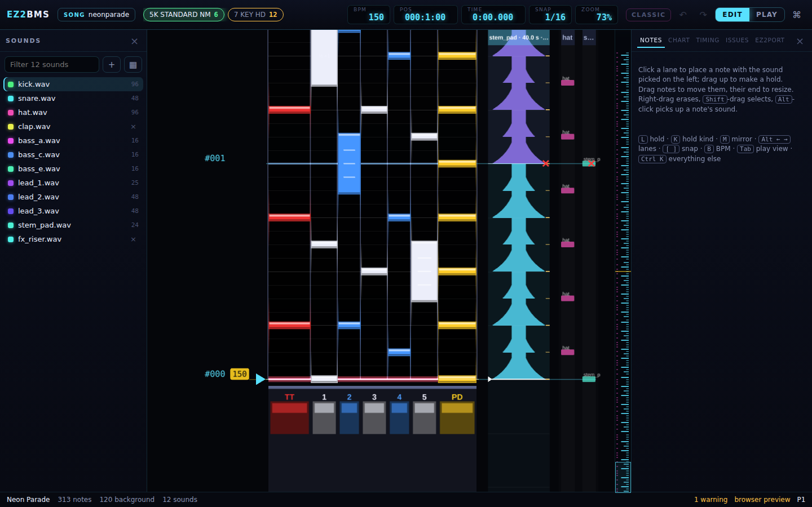
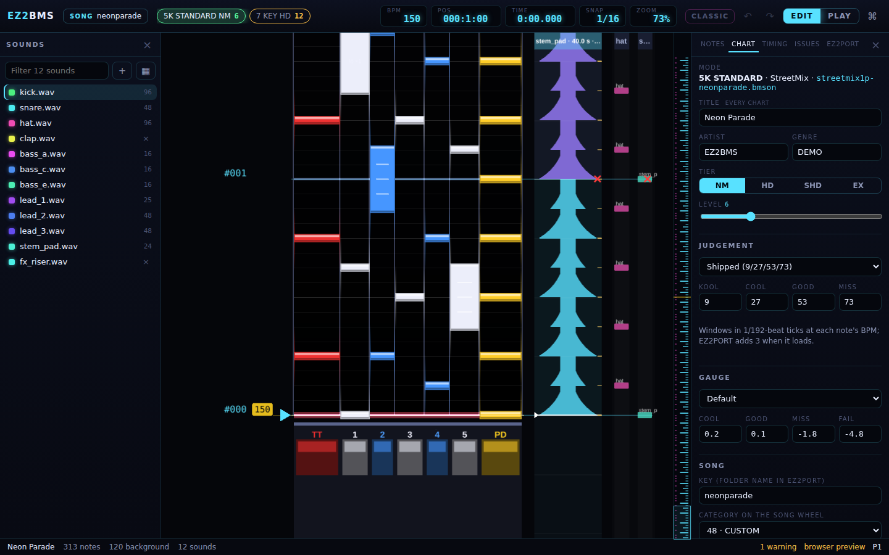
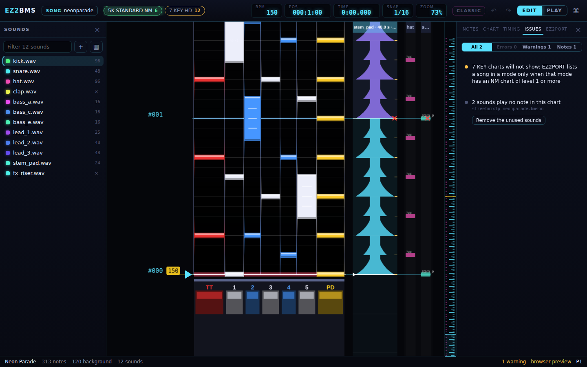

# Chart info, notes and issues

This chapter covers three tabs of the right-hand drawer: **Notes**, where you fine-tune the notes
you have selected; **Chart**, where you set what EZ2PORT shows and plays the chart by; and
**Issues**, the pre-flight check that tells you what would stop a publish or play differently in
EZ2PORT.

The drawer has five tabs: **Notes**, **Chart**, **Timing**, **Issues** and **EZ2PORT**. Timing is
covered in [Timing](07-timing.md) and the EZ2PORT tab in [Setting up EZ2PORT](05-ez2port-setup.md).
You can jump straight to a tab with a shortcut:

| Tab    | Command                   | Keys                                          |
| ------ | ------------------------- | --------------------------------------------- |
| Notes  | Inspector                 | <kbd>Ctrl</kbd>+<kbd>I</kbd>                  |
| Chart  | Chart info                | <kbd>Ctrl</kbd>+<kbd>J</kbd>                  |
| Issues | Issues (pre-flight check) | <kbd>Ctrl</kbd>+<kbd>Shift</kbd>+<kbd>I</kbd> |

On macOS, Ctrl is Cmd.

## The Notes tab

The Notes tab (the Inspector) shows what the selected notes are and lets you change them all at
once: which sound they play, how long a hold lasts, how the game pays it, and how loud and where
in the stereo field each note sounds.

With nothing selected, the tab shows a short reminder of the basics: click a lane to place a note
with the sound picked on the left, drag up to make a hold, drag notes to move them, right-drag to
erase, <kbd>Shift</kbd>-drag to select, and <kbd>Alt</kbd>-click to pick up a note's sound. It
also lists the most useful keys: <kbd>L</kbd> hold, <kbd>K</kbd> hold kind, <kbd>M</kbd> mirror,
<kbd>Alt</kbd>+<kbd>←</kbd> <kbd>→</kbd> lanes, <kbd>[</kbd> <kbd>]</kbd> snap, <kbd>B</kbd> BPM,
<kbd>Tab</kbd> play view, and <kbd>Ctrl</kbd>+<kbd>K</kbd> for everything else. See
[Charting](06-charting.md) for all of these.

### What the selection is

Once you select notes, **Selection** sums them up: how many notes, on how many lanes, how many of
them are background notes, and the position (measure:beat) of the first one.

When the selected notes disagree on a setting, the menu shows **(several)** and the slider shows
a dash. Changing it sets every selected note to the new value.

### Changing the sound

**Sound** lists every sound of the chart. Pick one to make every selected note play it. This is
the quickest way to swap a kick for another kick across a whole passage.

### Hold length and hold kind

**Hold, beats** is the length of the selected holds, in beats. The arrows step by one snap. Type
0 to turn holds back into taps. The empty box says **tap** when the selection has no holds, and
**mixed** when the holds have different lengths. If the length you type would run a hold into
another note on its lane, nothing changes and you see "That length would cover another note".

**Hold kind** is how EZ2 pays a hold while you keep it pressed. Each kind is listed with its
number and what it does:

| Kind   | What it pays while held                            |
| ------ | -------------------------------------------------- |
| 0      | every 1/4 beat (default)                           |
| 1      | every 1/2 beat                                     |
| 2      | every 1/8 beat                                     |
| 3      | every 1/16 beat                                    |
| 4      | once, after the end (counted as 1/32s: never 100%) |
| 5      | once, after the end (counted as 1/4s: never 100%)  |
| 6      | once at the end, if still KOOL                     |
| 7, 8   | nothing while held                                 |
| 9 - 12 | nothing; the head is not counted                   |

A kind the engine doesn't know shows as, for example, **14 (as 0)**: EZ2PORT plays it as kind 0.
<kbd>K</kbd> steps the selected holds to the next kind without opening the menu.

### Hold instalments

When the selection has holds, a line under the hold settings tells you how the game will score
them: "Judged 12× (heads and instalments), counted as 12." The first number is how many times the
game judges the holds (each head plus each instalment paid while held); the second is how many
notes they count for in the score.

Kinds 4, 5 and 9 to 12 count a hold differently from how they pay it. When that happens the line
turns amber and adds "A perfect play cannot score exactly 100%." That is how the game works, not
a mistake in your chart, but you may want to choose another kind.

### Velocity and pan

**Velocity** (0 to 127) is how loud each note plays, and **Pan** (0 to 127) where it sits between
left and right. Both are what the cabinet's mixer does with the note. Beside each label you see
what the setting means in decibels: velocity shows its value and the note's level in dB, and pan
shows **centre**, or L or R with how many dB quieter the other side is.

### Quick actions

At the bottom of the tab:

- **Hold** (<kbd>L</kbd>) makes the selected notes holds, or taps again.
- **Mirror** (<kbd>M</kbd>) mirrors them across the lanes.
- **Delete** removes them.

## The Chart tab

The Chart tab is where you set what EZ2PORT shows on the song wheel and how it judges the chart:
the title and level, the judgement windows and gauge, and the song's key and category. Some fields
belong to this chart only; the ones marked **every chart** belong to the whole song, and changing
them changes every chart of it.

### Mode

**Mode** shows the chart's mode as EZ2BMS names it, EZ2PORT's name for it, and the chart's file,
for example **7 KEY** · 7StreetMix · `7streetmix1p-neonparade-hd.bmson`. You choose the mode when
you create a chart (see [the New chart dialog](13-song-manager.md#making-a-new-chart)).

### Title, artist and genre

**Title** (**every chart**), **Artist** and **Genre** are the song's info, shared by every chart.
EZ2PORT's song list keeps only the first 32 bytes of the title, and the tab warns you with
"EZ2PORT's song list keeps the first 32 bytes" when yours is longer. Korean and Japanese
characters take 3 bytes each, so a title in those scripts reaches the limit sooner.

If the charts of a song don't agree (for example, an imported HD chart has a different artist),
the tab says "The charts differ in artist: this shows the NM chart's". Editing the field here
makes them all the same. The song-wide info, including the subtitle, is also in
[the Song manager](13-song-manager.md#song-info).

The title shown on the song wheel is the title plate, a picture made from this title. See
[Title plate](13-song-manager.md#title-plate).

### Tier and level

**Tier** is the chart's difficulty: **NM**, **HD**, **SHD** or **EX**. Click another tier to make
the chart that tier; its file is renamed to match when you save. If the song already has a chart
of that mode and tier, you see "... already exists - move that chart first".

**Level** is the number shown on the song wheel, from 1 to 20.

### Judgement

**Judgement** sets how wide the KOOL, COOL, GOOD and MISS windows are. Pick a preset from the
menu, or type your own values in the four boxes:

- **Shipped (9/27/53/73)**
- **Engine default (6/24/36/72)**
- **Common override (6/24/50/70)**
- **Lenient (7/30/50/80)**

The menu shows **Custom** when the boxes match no preset. The windows are in ticks of 1/192 beat
at each note's BPM, so they get shorter in milliseconds as the tempo rises. EZ2PORT adds 3 to
each when it loads the chart.

### Gauge

**Gauge** sets how much each judgement fills or drains the life gauge. Pick **Default**,
**Forgiving** or **Fast recovery**, or type your own values into the **COOL**, **GOOD**, **MISS**
and **FAIL** boxes. Positive values fill the gauge; negative values drain it. As with the
judgement windows, the menu shows **Custom** when the values match no preset.

### Song key and category

Under **Song**:

- **Key (folder name in EZ2PORT)** is the song key: the short name EZ2PORT files the song under,
  and the name every chart file is built from. It must be 1-15 lowercase letters or digits, and
  the tab says so if yours isn't. Change it before you publish for the first time, because a new
  key makes a new song in EZ2PORT.
- **Category on the song wheel** is the bank the song appears in on the song wheel, such as HOT,
  a game version, a level or a letter range. EZ2PORT lists the song in this one bank only (not in
  ALL). The default is CUSTOM (48).

## The Issues tab

The Issues tab is EZ2BMS's pre-flight check. It lists everything in the song that would stop a
publish, or that would play differently in EZ2PORT from how it looks in the editor. It checks
every chart of the song and the song as a whole (key, title plate, art, preview, BGA), and it
updates as you edit.

The status bar shows the same count all the time: for example **2 errors** or **1 warning**, or
**ready for EZ2PORT** when there is nothing to fix or look at. Click it to open the Issues tab.

### Errors, warnings and notes

Each finding has a level, shown by the colour of its dot:

- **Errors** (red) block Publish, and they block Test in EZ2PORT (<kbd>F5</kbd>) for the chart
  they are in. EZ2PORT would reject the chart, or play something different from what you
  charted. Examples: a level outside 1-20, two notes on one lane at the same moment, a hold that
  covers a later note, a song with no key, or a missing art file.
- **Warnings** (amber) don't stop anything, but you should look at them before you publish.
  Examples: a STOP (EZ2 has none, so EZ2PORT gets a gap in time instead), a title longer than the
  song list shows, notes that will be rounded to the nearest EZ2 tick, or a song with no disc art.
- **Notes** (grey) are for your information, such as what an import had to change.

When the list is empty, the tab says "Nothing to fix: this song is ready for EZ2PORT."

### Filtering the list

The buttons at the top filter the list: **All**, **Errors**, **Warnings** and **Notes**, each with
its count. A button with nothing to show is greyed out.

Findings are grouped by rule, worst first. A rule found more than once has a header with its name
and count.

### Going to a finding

Click a finding to go to it. EZ2BMS switches to the chart it is in (a song with several charts
shows the chart's file under each finding), selects the notes it is about, and moves the cursor
to them. For a finding about the song key, the level or the title, it opens the Chart tab so you
can fix the field.

### Quick fixes

Many findings have a button under them that fixes the problem for you, for example:

- **Snap them to the nearest EZ2 tick**
- **Move the extra notes to the background**
- **Shorten each hold to end before the note**
- **Make the start BPM match**
- **Bring the level into 1-20**
- **Move them to the background**
- **Remove the unused sounds**
- **Use EZ2's 4/4 bar lines**
- **Make one from the title** (for a missing or invalid song key)
- **Make it CUSTOM (48)** (for a category EZ2PORT doesn't know)

A fix is one undo step in its chart. The toast says, for example, "Snap them to the nearest EZ2
tick: done (Ctrl+Z undoes it)".

### Fix all

When a rule has a quick fix in more than one place, its header has a **Fix all** button. It
applies the fix everywhere the rule was found, as one undo step in each chart. When that touches
more than one chart, the toast offers to undo it in all of them at once.

### What an import said

When you import a song, what could not come across is listed in Issues too, so you can deal with
it later. Once you have read it, run **Forget what the import said (clear it from Issues)** from
the command palette to clear those findings. See [Importing](15-import.md).

## Details

- **Gauge names.** The four gauge boxes carry the names the chart's `.ini` file uses, and EZ2's
  engine reads the two negative ones crossed: the **MISS** box is what a FAIL judgement costs (a
  press between the GOOD and MISS windows), and the **FAIL** box is what a MISS costs (a note
  never pressed). A KOOL fills the gauge by the **COOL** value. The Play view scores the same way
  EZ2PORT does.
- **Judgement windows** are counted in 1/192 of a beat at the note's own BPM, and the edges count
  as inside the window.
- The file formats behind these settings are described in [bmson-dialect.md](../bmson-dialect.md)
  and [song-file.md](../song-file.md).

Next: [The Song manager](13-song-manager.md)
