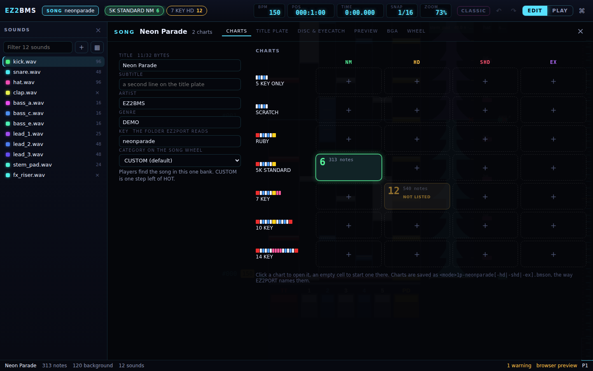
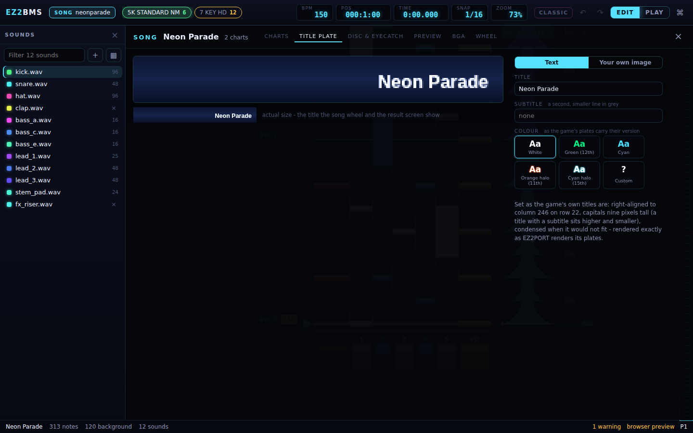
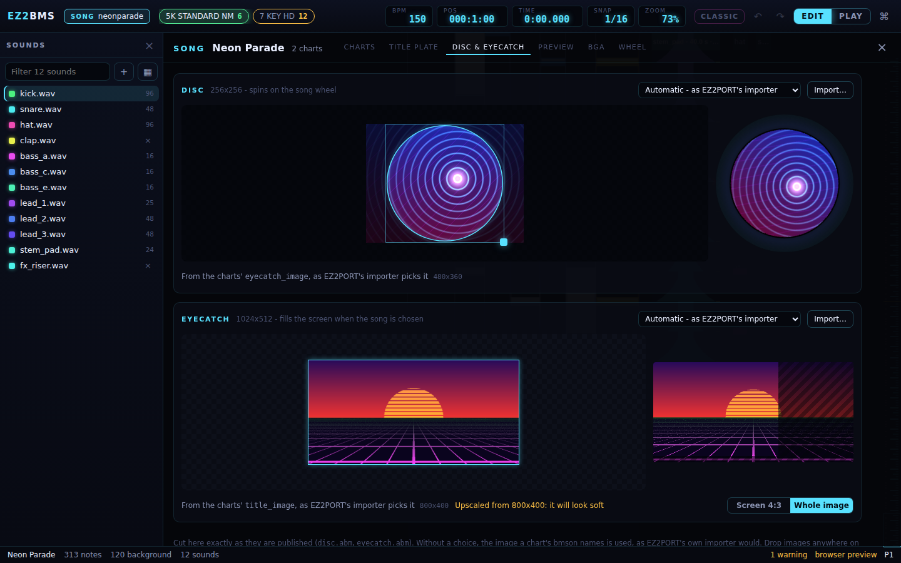
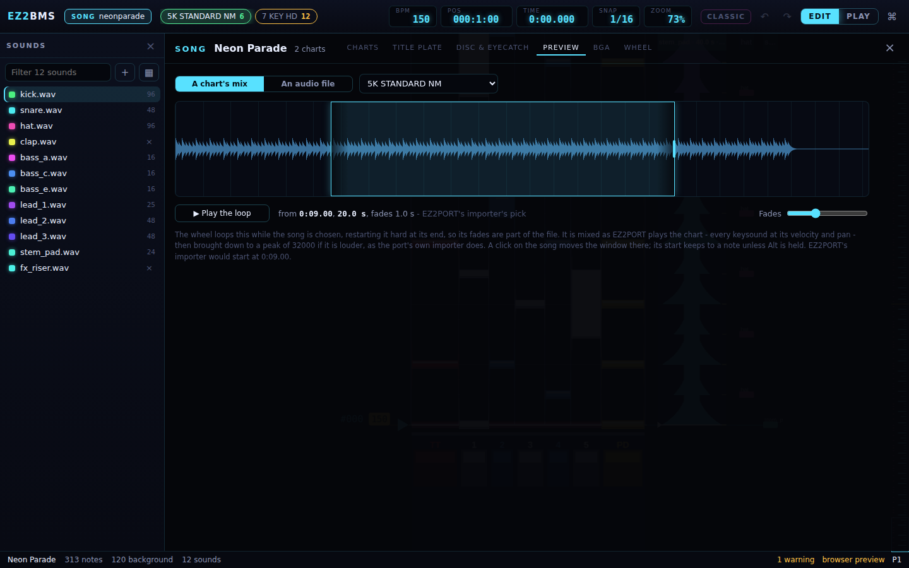
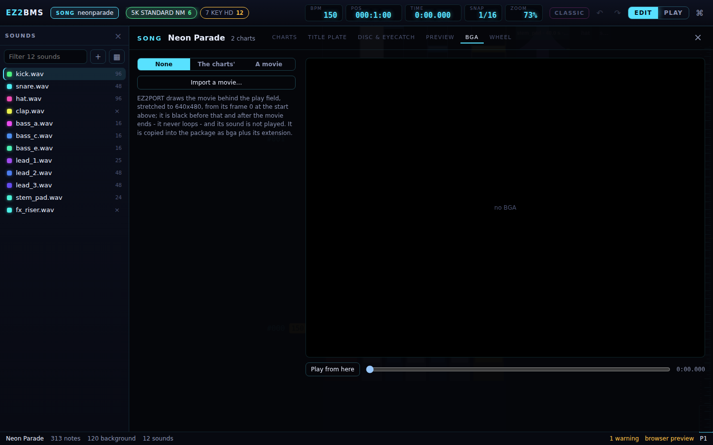
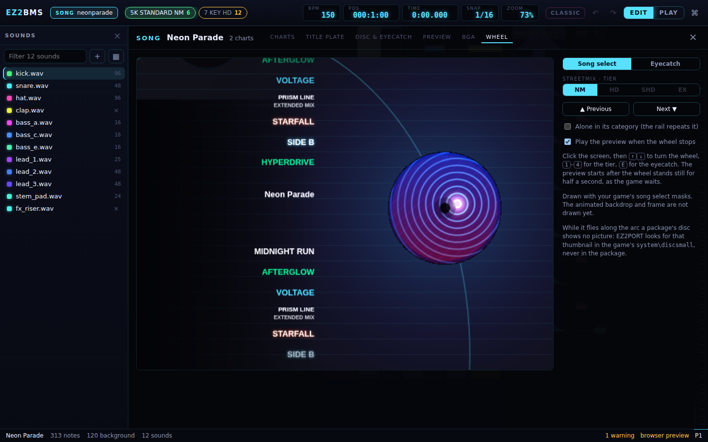
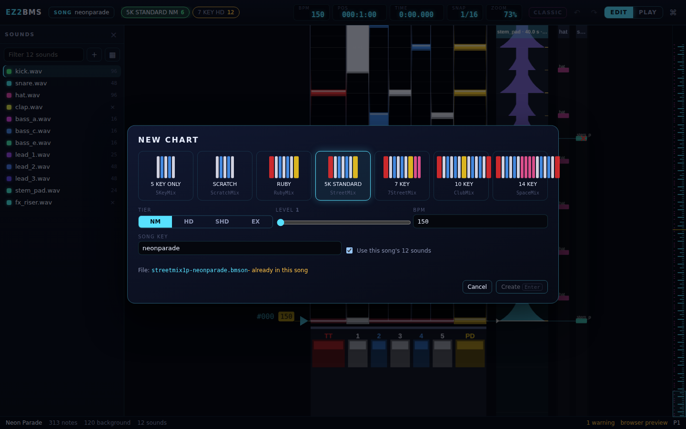

# The Song manager

This chapter covers the Song manager, where you look after everything that belongs to the song
rather than to one chart: its info and category, all of its charts, its title plate, disc and
eyecatch, its preview, its BGA movie, and how it will all look on EZ2PORT's song select. It also
covers making new charts and new songs.

## Opening the Song manager

Press <kbd>Ctrl</kbd>+<kbd>Shift</kbd>+<kbd>L</kbd>, or click **SONG** (with the song's key
beside it) in the top bar. On macOS, Ctrl is Cmd.

The Song manager covers the playfield. Its header shows the song folder's name and how many charts
the song has, then six tabs: **Charts**, **Title plate**, **Disc & eyecatch**, **Preview**,
**BGA** and **Wheel**. Press <kbd>Esc</kbd> or click **×** to close it and go back to charting.

## Charts

The Charts tab has the song's info on the left and every chart of the song on the right.

### Song info

The fields on the left are shared by every chart of the song:

- **Title**. The count beside it (for example **18/32 bytes**) turns amber past 32 bytes, the most
  EZ2PORT's song list keeps.
- **Subtitle**: a second line on the title plate.
- **Artist** and **Genre**.
- **Key**: the folder EZ2PORT reads, that is the song key. It must be 1-15 lowercase letters or
  digits. Changing it renames the chart files the next time you save.
- **Category on the song wheel**: see [Choosing a category](#choosing-a-category).

A text field takes effect when you leave it or press <kbd>Enter</kbd>. The change is made in every
chart, and the toast ("Song info changed in 3 charts") lets you undo it in all of them at once. If
the charts disagree on a field, it is marked **charts differ**; saving a value here makes them
equal.

### Choosing a category

The category is the bank of the song wheel where players find the song. EZ2PORT lists your song
in this one bank only, not in ALL as well. The menu groups the banks the way the game does:

- **The port’s own**: CUSTOM, the default. It sits one step left of HOT.
- **Featured**: HOT, NEW, ALL.
- **Game versions**: 1st to TT.
- **Levels**: LV1 to LV18+.
- **Title A-Z**: ABC to YZ+.
- **Other**: OTH.

Some modes' pagers skip some banks. RubyMix jumps from LV12 straight to ABC, and 5KeyMix from
LV17, so a song filed in a skipped bank can't be reached in that mode. When that affects one of
your charts, the picker says so, for example "The ruby pager skips this bank."

### The chart matrix

The matrix has one row per mode EZ2PORT plays (**5 KEY ONLY**, **SCRATCH**, **RUBY**,
**5K STANDARD**, **7 KEY**, **10 KEY**, **14 KEY**) and one column per tier (**NM**, **HD**,
**SHD**, **EX**). Each row shows the mode's lanes in miniature.

Each chart's cell shows its level and number of notes, plus badges:

- a dot if the chart has unsaved changes;
- a red number for its errors and an amber number for its warnings (see
  [Issues](12-chart-info-and-issues.md#the-issues-tab));
- **not listed** when the mode has no NM chart of level 1 or more. EZ2PORT only lists a mode's
  charts when that mode has an NM chart, so you should chart the NM first.

What you can do in the matrix:

- **Open a chart**: click its cell. The Song manager closes and the chart opens.
- **Start a chart**: click an empty cell (**+**). The new chart starts with the open chart's sound
  list, and opens. To choose its level and BPM first, use [the New chart dialog](#making-a-new-chart)
  instead.
- **Copy a chart**: click **Copy**, then click an empty cell (it says **here**). The copy has the
  same notes, sounds and timing. You can copy into any mode.
- **Move a chart**: click **Move**, then click an empty cell in the same row to make the chart
  another tier. Its file is renamed when you save.
- **Remove a chart**: click **×**. The chart's file is moved into a `.ez2bms-trash` folder inside
  the song folder, and the toast offers **Undo** for 15 seconds, which brings the chart back
  with its unsaved edits and history.

Press <kbd>Esc</kbd> to cancel a copy or move.

Charts are saved under the names EZ2PORT uses: the mode, the song key and the tier, for example
`7streetmix1p-neonparade-hd.bmson`.

## Title plate

The title plate is the 256×32 picture of the title that EZ2PORT's song wheel and result screen
show. It is the only title they show, so it matters more than the title text. The tab shows the
plate large, and at actual size the way the song wheel draws it. What you see is rendered exactly
as EZ2PORT renders its plates.

Under **What the plate shows**, choose **Text** or **Your own image**.

### A text plate

With **Text**, EZ2BMS sets your title the way the game's own titles are set: right-aligned,
capitals nine pixels tall, and condensed when it wouldn't fit. A title with a subtitle sits higher
and smaller.

- **Title** starts as the song's title. Type something else to put other words on the plate (for
  example a shorter or romanized title); the label then says **differs from the song's**.
- **Subtitle** is a second, smaller line in grey. It starts as the song's subtitle; the box says
  **none** when there isn't one.
- **Colour** picks one of the shipped plates' colours, which carry a game version: **White**,
  **Green (12th)**, **Cyan**, **Orange halo (11th)** and **Cyan halo (15th)**. Choose **Custom**
  to mix your own: **Letters** sets the letters' colour, and **Halo** turns on a glow around them
  and sets its colour.
- **CJK forms** appears when the title has Chinese, Japanese or Korean characters. It sets how
  shared ideographs are drawn: **Automatic** (Japanese if the title has kana, otherwise Korean),
  **Korean**, **Japanese**, **Chinese (Simplified)**, **Chinese (Traditional, Taiwan)** or
  **Chinese (Traditional, Hong Kong)**.

If the plate's fonts don't have a character in your title, the tab warns you that it will come out
as a box.

### Your own image

With **Your own image**, choose an **Image** from the song folder, or click **Import…** to add one.
A 256×32 image is used as it is; any other size is squeezed to fit. Leave the background black:
the wheel adds the plate onto its row, so black lets the row show through.

## Disc & eyecatch

This tab crops the song's two pictures:

- **Disc**: 256×256, the disc that spins on the song wheel.
- **Eyecatch**: 1024×512, which fills the screen when the song is chosen.

Each is cut exactly as it will be published, and the result is shown on the right: the disc
spinning as on the wheel, the eyecatch with the part the screen shows.

### Choosing the image

The menu beside each name offers:

- **Automatic - as EZ2PORT's importer**: the image a chart names, picked the way EZ2PORT's own
  importer would pick it. The footer then says which chart field it came from.
- **None**: no disc or no eyecatch for this song. Without a disc the wheel shows a blank one.
- Any image in the song folder.

Click **Import…** to copy images into the song folder, or drop images anywhere on the tab. Nothing
in the folder is overwritten.

### Cropping

Drag the frame to move it and its corner to resize it, or use the mouse wheel to zoom. With the
frame focused, the arrow keys nudge it by one pixel (<kbd>Shift</kbd> for ten), and <kbd>+</kbd>
and <kbd>-</kbd> zoom.

For the eyecatch, **Eyecatch framing** has two choices:

- **Screen 4:3**: your 4:3 crop fills the screen; the image carries on past its edges.
- **Whole image**: the whole image squeezed to 1024×512, as EZ2PORT's importer does.

**Reset** puts the crop back to its default. If the image is smaller than the picture it
fills, you see "Upscaled from ...: it will look soft".

## Preview

The preview is the loop the song wheel plays while your song is highlighted. The wheel loops it
and restarts it hard at its end, so its fade in and fade out are part of the file.

### Where the preview comes from

Under **What the preview is cut from**, choose:

- **A chart's mix**, and pick the **Chart**. EZ2BMS mixes the chart as EZ2PORT plays it, every
  keysound at its velocity and pan, then brings it down to a safe peak if it is louder, as the
  port's own importer does.
- **An audio file**, and pick the **Audio file** from the song folder (WAV, OGG, FLAC or MP3).

### Choosing the window

The overview shows the whole song's loudness, with the preview window on it:

- Drag the window to move it, and pull its right edge to change its length (5 to 30 seconds).
- Click anywhere on the song to move the window there.
- With the window focused, the arrow keys nudge it by 0.1 s (<kbd>Shift</kbd> for 1 s).
- When cutting from a chart, the start keeps to a note unless you hold <kbd>Alt</kbd>.

Below the overview you see where the loop starts, how long it is and how long it fades, for
example "from 1:02.50, 12.0 s, fades 1.0 s". Until you move it, it says **EZ2PORT's importer's
pick**: the start EZ2PORT's own importer would choose.

Click **▶ Play the loop** to hear it as the wheel will (**■ Stop** stops it). **Fades** sets the
fade length, up to 3 seconds. **Reset** puts the window and fades back to their defaults.

## BGA

The BGA is the movie EZ2PORT draws behind the play field, stretched to 640×480. It starts at the
time you set and never loops: the screen is black before it starts and after it ends. The movie's
own sound is not played.

### Choosing the movie

Under **Which movie**:

- **None**: no BGA.
- **The charts'**: the movie a chart names, as EZ2PORT's importer would take it. This is greyed
  out when no chart names one.
- **A movie**: pick a **Movie** from the song folder.

Click **Import a movie…** to copy one into the song folder.

### Will EZ2PORT play it?

EZ2BMS reads the movie and lists its **File**, **Container**, **Video** codec, **Size** and
**Length**. Then it tells you whether EZ2PORT's Windows build can play it ("EZ2PORT's Windows build
plays it.") or why not, for example that it has no AVI reader or no decoder for the codec, and
what to convert it to (H.264 in MP4, or VP9 in WebM).

Below that, EZ2BMS warns you if the movie is too large for EZ2PORT's cabinet (640×480 is all it
shows), if it isn't 4:3 (it will be stretched), or if it ends before the song does.

### When it starts

**Frame 0 at (chart ms)** is when the movie's first frame shows, in milliseconds of chart time.
Type a value, or click:

- **The chart's event**: the time the chart's first BGA event gives, as the importer times it;
- **At 0**: the very start;
- **At the cursor**: the editor's cursor position.

### Watching it

The screen on the right plays the movie against the song. Click **Play from here** (and **Stop**),
or drag the **Song position** slider. This preview uses the app's own video player, which can show
some movies EZ2PORT can't, and the other way round. Trust the verdict on the left.

## Wheel

The Wheel tab shows your song as EZ2PORT's song select will: its disc at the focus, its title
plate on the rail between other songs', its preview, and the eyecatch the screen exits through.
Use it to check everything together before you publish.

Under **Screen**, choose **Song select** or **Eyecatch**.

On **Song select**:

- The tier buttons (**NM**, **HD**, **SHD**, **EX**) pick the tier, as the game does. A tier with
  no chart in this mode is greyed out.
- **▲ Previous** and **Next ▼** turn the wheel.
- **Alone in its category (the rail repeats it)** shows the song as it looks in a category that
  holds only this song.
- **Play the preview when the wheel stops** plays your preview once the wheel has stood still for
  half a second, as the game waits.

On **Eyecatch**, **Replay the fade** plays the exit again: the eyecatch fading in from black under
the stage mask and plate.

You can also click the screen and use the keys: <kbd>↑</kbd> <kbd>↓</kbd> turn the wheel,
<kbd>1</kbd>-<kbd>4</kbd> pick the tier, and <kbd>E</kbd> switches to the eyecatch and back.

With your game folder set (see [Setting up EZ2PORT](05-ez2port-setup.md)), the wheel is drawn with
your game's own song select masks. Without it, neon stand-ins take their place. The animated
backdrop and frame are not drawn yet.

## Making a new chart

Press <kbd>Ctrl</kbd>+<kbd>N</kbd> (**New chart…**) to add a chart to the open song.

1. Pick the mode from the wheel at the top. Each mode shows its lanes, its name and EZ2PORT's name
   for it.
1. Pick the **Tier** and drag the **Level** slider (1 to 20).
1. Set the **BPM** the chart starts at. It starts as the open chart's.
1. Check the **Song key**. If the song has none yet, EZ2BMS suggests one from the folder name.
1. Leave **Use this song's N sounds** ticked to start with the open chart's sound list.
1. Click **Create** or press <kbd>Enter</kbd>.

The line **File:** shows the name the chart will be saved as. If the song already has that chart,
it says "- already in this song" and **Create** is greyed out. **Create** is also greyed out until
the song key is valid. **Cancel** or <kbd>Esc</kbd> closes the dialog. The new chart opens, unsaved
until you save.

## Making a new song

The **New song** button on the start screen (and **New song…** in the command palette) starts a
song from scratch. It is only on the desktop app.

1. Choose a folder for the new song. It can be empty, or already hold the song's sounds.
1. EZ2BMS opens the folder and shows the New chart dialog, so you can make the first chart.

To start from an existing song instead, see [Importing](15-import.md).

Next: [Publishing and testing](14-publish-and-test.md)
