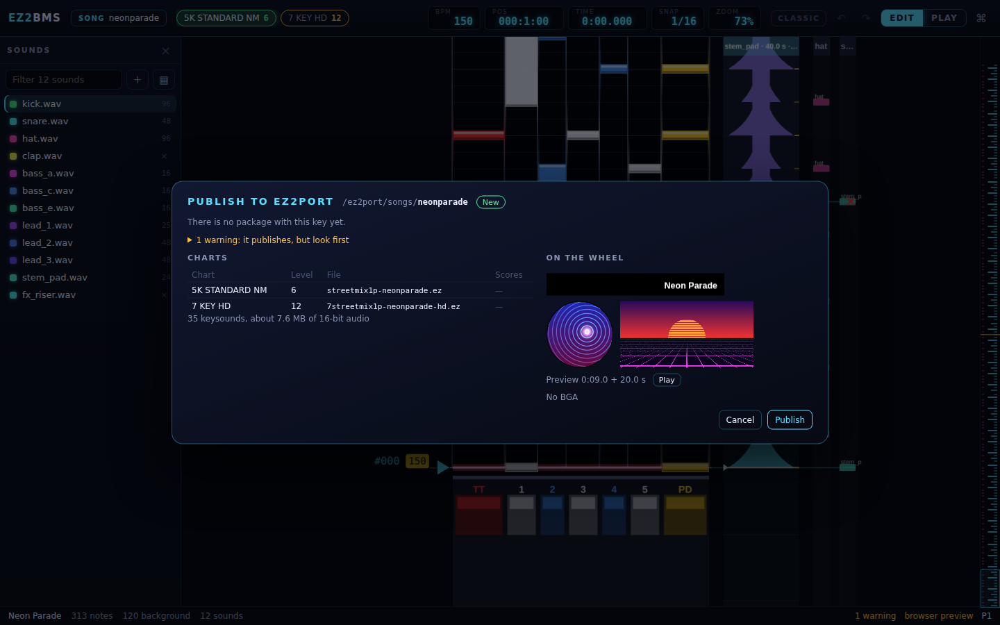

# Publishing and testing

This chapter covers getting your song into EZ2PORT: publishing it into EZ2PORT's songs folder so it
shows up on the song wheel, and testing a chart in EZ2PORT itself while you work. Both need the
desktop app: the browser preview can't run EZ2PORT or write to your songs folder.

Before you start, set up the EZ2PORT tab (your game folder, ez2play and the songs folder), as
described in [Setting up EZ2PORT](05-ez2port-setup.md). On macOS, Ctrl is Cmd.

## What publishing does

Publishing writes your song as an EZ2PORT package: a folder named after the song key, inside
EZ2PORT's songs folder. It holds every chart converted to EZ2's own format, the keysounds, the
title plate, disc and eyecatch, the preview and the BGA. EZ2PORT then lists the song on its song
wheel, in the category you chose.

EZ2BMS works out everything the package will be before it writes a single file, and shows it to
you. Nothing is written until you click **Publish**. Your charts are saved first.

## The Publish dialog

Press <kbd>Ctrl</kbd>+<kbd>Shift</kbd>+<kbd>P</kbd> (**Publish to EZ2PORT**), or click
**Publish song** on the EZ2PORT tab. The dialog is headed **Publish to EZ2PORT**.

### If there are errors

If the song has any errors in [Issues](12-chart-info-and-issues.md#the-issues-tab), there is
nothing to publish until you fix them. The dialog says, for example, "3 problems to fix first" and
lists them. Click **Show them in Issues** to go and fix them.

### If the songs folder isn't set

If you haven't told EZ2BMS where EZ2PORT keeps its songs, the dialog asks: "Choose the folder
EZ2PORT keeps its songs in (its `ez2port/songs`)." Click **Choose the songs folder…**. EZ2BMS
remembers it (it is **Publish into** on the EZ2PORT tab).

While it prepares, the dialog says "Rendering the title plate and art, compiling every chart,
reading what is in the songs folder…".

### The destination and whose it is

The header shows where the package goes, the songs folder and then the song key, and a badge that
says what is there now:

| Badge                      | What it means                                                                                                                            |
| -------------------------- | ---------------------------------------------------------------------------------------------------------------------------------------- |
| **New**                    | There is no package with this key yet.                                                                                                   |
| **Update**                 | This song's earlier publish is replaced (kept in `.ez2bms-backup`).                                                                      |
| **Earlier EZ2BMS package** | A package from an earlier EZ2BMS, with no song id: it may be this song. Tick **Replace it with this song** to go on.                     |
| **Another song's package** | Another tool or song made this folder. To replace it, type the song key into the box. Replacing it keeps a copy in `.ez2bms-backup`.     |
| **Shipped key**            | The key is one of a song the game ships. EZ2PORT would play your package in its place everywhere, so EZ2BMS refuses. Choose another key. |

For anything but **New**, the button reads **Publish over it**.

### Warnings

Warnings don't stop a publish, but the dialog reminds you of them: "2 warnings: it publishes, but
look first". Click the line to see them.

### Charts and scores

The **Charts** table lists every chart: **Chart**, **Level**, the **File** it becomes in the
package, and **Scores**, which says what happens to the high scores EZ2PORT has recorded for it:

- **kept**: the chart hasn't changed since it was last published, so its rankings stay.
- **reset (changed)**: the chart has changed, so its old rankings are cleared. Scores set on a
  different chart wouldn't mean anything.
- **—**: there are no scores for it yet.

Below the table is the size of the keysounds, for example "412 keysounds, about 38.2 MB of 16-bit
audio". Publishing cuts every keysound (including each slice of a stem) to its own 16-bit stereo
44.1 kHz file.

### On the wheel

**On the wheel** shows the title plate, disc and eyecatch decoded from the very files Publish will
write, so what you see is what EZ2PORT will show. It also shows the preview (where it starts and
how long it is, with **Play** and **Stop** to hear it) and the BGA (which movie, and from when).
"no disc", "no eyecatch", "No preview: the wheel is silent for this song" and "No BGA" tell you
what is missing. To change any of these, use [the Song manager](13-song-manager.md).

### Publishing

Click **Publish** (or **Publish over it**). The dialog says "Cutting 412 keysounds and writing the
package…" while it works, then what came of it, for example:

> Published neonparade: 431 files in D:/ez2port/songs/neonparade (kept 3 ranking tables, reset 1
> for changed charts)

If a keysound's source file couldn't be read, the dialog lists it. Click **Done** to close.

### Backups

When a publish replaces a package, the old one is moved into a `.ez2bms-backup` folder inside the
songs folder first. EZ2PORT skips folders whose names start with a dot, so the backup never
appears on the wheel. The old package is kept there in case you need it back.

### After changing the song key

If you published the song before under another key, the old package is still in the songs folder,
and the song would appear twice. The finished dialog says "This song is still in the songs folder
as "oldkey" too." Click **Remove that copy** to take it off the wheel. It is moved into
`.ez2bms-backup`, not deleted.

## What "ready for EZ2PORT" means

The status bar shows **ready for EZ2PORT** when Issues has no errors and no warnings. Then:

- Publish won't be blocked;
- nothing in the song plays differently in EZ2PORT from how it plays in the editor, as far as
  EZ2BMS's checks can tell.

When the Issues list is empty altogether, the Issues tab says "Nothing to fix: this song is ready
for EZ2PORT." Notes (grey findings) don't affect this.

## Testing in EZ2PORT

Testing plays the chart you're editing in EZ2PORT itself, so you can check it in the real game
engine without publishing.

- Press <kbd>F5</kbd> (**Test in EZ2PORT**) to play it yourself.
- Press <kbd>Shift</kbd>+<kbd>F5</kbd> (**Watch in EZ2PORT (autoplay)**) to watch the game play it.

On the EZ2PORT tab, the **Test** and **Auto** buttons do the same.

What happens:

- EZ2BMS packages the chart you're editing into a private, temporary songs folder, not your real
  one. Nothing is published, and the folder is removed when the test ends.
- EZ2PORT opens in a window, at the Play view's scroll speed.
- If your ez2play can start part-way through a chart, the test starts at the cursor. Otherwise it
  starts from the beginning, and the log says so. If your ez2play can skip the READY screen, it
  does.
- The chart's BGA plays.
- Starting another test stops the one that is running.

A test needs your game folder and ez2play to be set. If they aren't, EZ2BMS opens the EZ2PORT tab
and says "Set your game folder (and ez2play) in the EZ2PORT tab first". A chart with errors can't
be tested either: EZ2BMS opens Issues and says how many problems there are to fix first. Errors in
other charts of the song don't stop the test.

The EZ2PORT tab lists what your ez2play build can do, such as a private songs folder, starting from
the cursor and skipping READY. See [Setting up EZ2PORT](05-ez2port-setup.md).

To stop a test, click **Stop** in the run log, or run **Stop the EZ2PORT test** from the command
palette.

## The run log

The run log opens along the bottom of the editor when a test starts. It shows everything EZ2PORT
prints while it runs, and EZ2BMS's own messages, such as which chart it is testing and at what
speed. While a test runs, its header says **running** and the status bar says **EZ2PORT running**
(click that to open the log).

When EZ2PORT closes, the log says how it ended:

- "EZ2PORT closed normally."
- "EZ2PORT did not understand the command line (exit 2): this build may be older or newer than
  EZ2BMS expects."
- "EZ2PORT could not find the game data it needs (exit 77)." Check your game folder.
- Otherwise, for example, "EZ2PORT ended: failed (exit 1)."

**Clear** empties the log and **×** hides it. **EZ2PORT log** in the command palette shows or hides
it again.

## Details

- Each song gets a song id the first time you publish it. That is how EZ2BMS tells your song's
  earlier packages (**Update**) from a package someone else made under the same key.
- Scores are kept for a chart whose EZ2 chart file and settings file come out exactly the same as
  in the package being replaced.
- How EZ2BMS's package compares with EZ2PORT's own importer, and what EZ2PORT does with it, is in
  [ez2port-compat.md](../ez2port-compat.md).

Next: [Importing](15-import.md)
