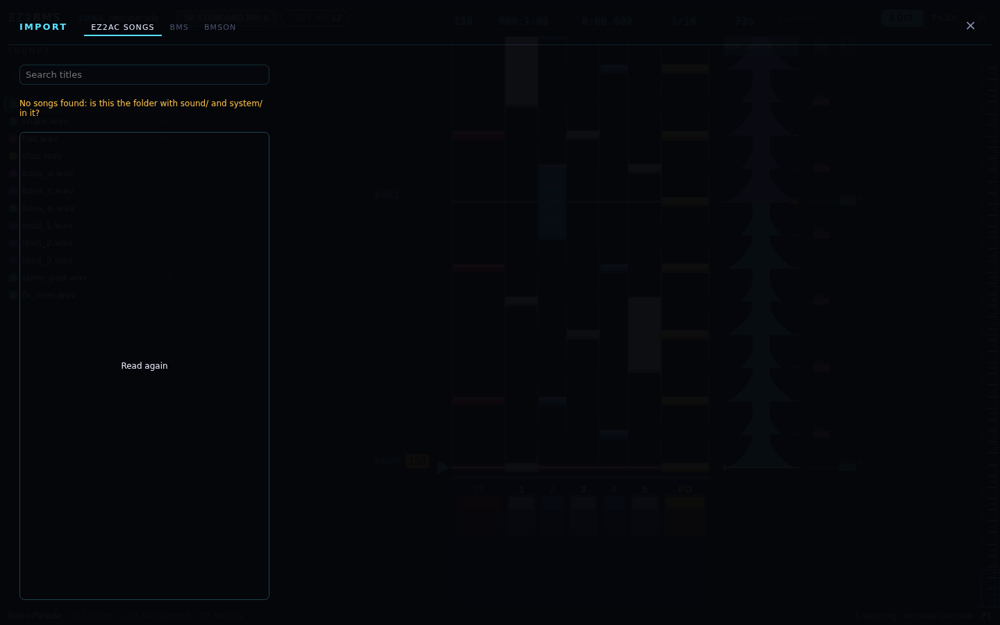

# Importing

This chapter covers making an EZ2BMS song out of something that already exists: one of the game's
own songs, a folder of BMS files, or a bmson. It also covers cutting a stem at the notes of a MIDI
file of the song.

## The Import wizard

Open the Import wizard in any of these ways:

- click **Import…** on the start screen;
- run **Import a song… (EZ2AC, BMS, bmson)** from the command palette (<kbd>Ctrl</kbd>+<kbd>K</kbd>;
  on macOS, Ctrl is Cmd);
- drop a BMS file on the window, or open one with EZ2BMS from your file manager. The wizard opens
  on the BMS tab with that file's folder already read.

The wizard has three tabs: **EZ2AC songs**, **BMS** and **bmson**. Press <kbd>Esc</kbd> or click
**×** to close it.

### You see every guess first

Reading another format means making guesses: the text encoding, which lanes the channels are, the
mode, the tier. The wizard shows every guess before anything is written, and you can change it.

What could not come across is listed under "N things to know (they go to Issues)". The list stays
in [Issues](12-chart-info-and-issues.md#what-an-import-said) with the song, so you can deal with it
later. When you have, run **Forget what the import said (clear it from Issues)** from the command
palette.

### Where the new song goes

Under the details, **New folder** is where the new song folder will be made. It starts beside the
last song you opened, named after the song's title. Type another path, or click **Choose…**.

Click **Import**. The new song is written all at once: if anything fails, there is no half-written
song. While it works you see how many files are done ("120 / 431 files"). The new folder then
opens, and the toast says "Imported 4 charts - Issues says what could not come across".

## Importing one of the game's songs

The **EZ2AC songs** tab makes an EZ2BMS song out of one of your game's own songs, so you can remix
it or chart it anew.

### What it needs

- **Your game folder**, the one with `sound/` and `system/` in it, set on the EZ2PORT tab (see
  [Setting up EZ2PORT](05-ez2port-setup.md)). Without it, the tab says "Set your EZ2AC data folder
  on the EZ2PORT panel first". The browser preview can't set a game folder, so you need the desktop
  app.
- **Your unpacked EZ2AC executable**. The game's song tables and charts are encrypted with keys
  that live in it. Set it on the EZ2PORT tab too. If none is set, EZ2BMS looks for an `.exe` in the
  game folder that holds the keys, as EZ2PORT does.

EZ2BMS keeps nothing of the game: it reads your files when you import.

### Choosing the song

The list shows the songs the game's own song tables offer, with each one's title, folder, BPM and
charts. Type in **Search titles** to find one by its title or folder name. If you changed the game
folder, click **Read again**.

The game has no song titles as text, only the title plate pictures. EZ2BMS takes the titles from
EZ2PORT's text manifest (`text/manifest.songs.ini`, beside `ez2play`). Without the manifest, a song
goes by its folder name.

Click a song to see what it becomes: its new song key, its category and how many keysounds it has,
then each chart with its level, its number of notes and the file it becomes. Each chart the song's
tables offer becomes one chart of the new song.

### The new song gets a new key

The imported song gets a **new song key**. Publishing under the game's own key would replace that
song on the wheel, so the key comes from the title, with a digit added until no song in the game's
`sound/` folder has it. The original key is kept with the song, so a
[cabinet export](16-export.md) can write the song back into the game.

### What comes across

Everything the game plays comes across exactly:

- Every note is at exactly the position it had. Nothing is rounded.
- The tempo is the same, so every note plays at the same millisecond as in the game engine.
- Lane notes keep their velocity, pan and hold kind.
- Notes on the game's other tracks become background notes, keeping their track.
- Each keysound becomes one sound. The game's `.ssf` sounds become `.wav` files with the same
  samples. A sound borrowed from another song goes under that song's name (for example
  `stay/p_MR.wav`).
- The chart's judgement windows and gauge come from its `.ini` file. A chart with no `.ini` gets
  the engine's defaults, as the game plays it.
- The level comes from the game's song table (or from the `.ini` when the table has none).
- The category comes from the song's version bank in the song table (1st ... TT). Otherwise it is
  CUSTOM.
- Scroll-speed changes become the chart's own. The Play view scrolls with them, the Timing tab
  edits them, and they publish. Each keeps the track and settings it had, so a cabinet export
  writes the same record back.

### What won't publish

Nothing is dropped, but some things can't go into an EZ2PORT package. Issues tells you about each:

- Track volumes, beats-per-measure, marks, and the stops the engine ignores. They are kept with the
  chart for a cabinet export, and shown read-only as grey tags in the gutter and in the Timing tab.
- A background note's length. Publishing writes background notes as taps, as the engine plays
  them.
- Two keysound slots naming one file. They become one voice, so two of them at once cut each
  other.
- Keysounds the game folder doesn't have, and notes on slots the keysound list doesn't list.

Some old keysound lists name their notes like MIDI keys (`C#0 1 mix-st.wav`). EZ2PORT reads all of
those as note 0. EZ2BMS reads them as notes (octave × 12 + semitone), so each note keeps its own
sound. See [ez2port-compat.md](../ez2port-compat.md).

## Importing BMS, BME and BML

The **BMS** tab makes a song out of a folder of BMS files. Type the folder's path into **Folder**
and click **Read** (or press <kbd>Enter</kbd>), or click **Choose…**. Each `.bms`, `.bme`, `.bml`
or `.pms` file in the folder becomes one chart of the song. Sounds are found in the folder and its
subfolders. If there are no such files, the tab says "No .bms, .bme, .bml or .pms files in that
folder".

The table has one row per file, with its **File**, its **Title** and number of notes, and these
choices:

- **Text**: the file's text encoding: **UTF-8**, **Shift-JIS** or **EUC-KR / CP949**. It is UTF-8
  when the bytes are valid UTF-8; otherwise Shift-JIS or Korean, told apart by the bytes. A guess
  is marked **?**. If the title looks wrong, pick another encoding.
- **Random**: for each `#RANDOM` (and `#SWITCH`) block, the value it takes. The default is 1, and
  nested blocks are followed.
- **Lanes**: how the BMS channels map to lanes.
  - **EZ2 BME**: EZ2's own channels: keys 11-15, turntable 16, pedal 17, effectors 18/19, and the
    2P side on 21-29.
  - **Keys in order**: the IIDX/beat layout. Each side's keys (1-5, 6, 7) go onto that side's keys
    left to right, and a double mode's keys are split into a left and a right half. It differs from
    EZ2 BME on SpaceMix's and AndromedaMix's 2P side (EZ2 puts the effectors between the sides), and
    it leaves 17/27 (EZ2's pedals) to the background.
- **Mode** and **Tier**: guessed from the lanes used (the smallest mode that has them all) and from
  `#DIFFICULTY` or the file name. Two files can't be the same chart: the second is marked
  **taken** until you give it another tier.
- The tick box at the end: untick it to leave the file out.

Under the table, a summary gives the new song key, how many charts and how many files it uses.

### Big packs: writing beside the BMS files

Tick **Write the song beside the BMS files (nothing copied)** to write the charts and the song file
into the BMS folder itself, instead of copying everything into a new folder. Use it for large
packs. EZ2BMS won't overwrite a file that is already there: if one has the same name, the import
stops and tells you.

### What comes across from BMS

- **Positions are exact.** A measure's length (`#xxx02`) is read as the fraction it stands for
  (0.75 is 3/4, 0.333 is 1/3), and the song's resolution is the smallest that puts every note on
  a whole pulse.
- **Tempo** comes from `#BPM` and channels 03 and 08. **Stops** come from channel 09. EZ2 has no
  stops, so publishing turns each one into a gap in time.
- **Long notes** come from channels 5x/6x (`#LNTYPE` 1 and 2) and from `#LNOBJ`.
- **Art**: `#STAGEFILE` becomes the eyecatch and `#PREVIEW` the preview. BGA images are kept, but
  EZ2PORT plays only movies.

Left out, and listed: hidden notes (channels 3x/4x), mines, and `#SCROLL`/`#SPEED`.

## Opening a bmson

A bmson needs no import: it opens as it is. The **bmson** tab explains this and has an **Open a
folder…** button: open the folder the bmson is in, as you would any song (see
[Quick start](03-quick-start.md)).

EZ2BMS also reads bmson files written by other tools:

- **bmson 0.21** (BmsONE's older format) is read as 1.0, and saved as 1.0.
- **Lanes numbered the BMS way** (`beat-7k`, `beat-10k`) are moved onto EZ2's. `beat-10k` is
  written two ways; notes on lane 9 or 10 mean the bmson spec's numbering.
- **BmsTWO's bmson** is already 1.0.
- **circus2bmson's output** (all background sounds, at resolution 480 or the MIDI's) opens the same
  way.

Issues says what changed.

## Cutting a stem at a MIDI file's notes

If you have a MIDI file of the song, exported from the DAW your stem came from, it knows exactly
where each hit is, better than onset detection can. A stem's strip panel has **Cut at a MIDI file's
notes** for this. Only where notes start matters, not their pitch. See [Slicing](09-slicing.md) for
the strip panel.

1. Click **MIDI file…** and choose the file, then pick the tracks to use.
1. The MIDI's time 0 is the stem's first hit. Choose one:
   - **Keep the chart's tempo**: each note is placed at its MIDI time.
   - **Take the MIDI's tempo from the stem's first hit**: each note sits on its beat. Changing the
     tempo moves anything else charted after the hit, and the panel tells you how many notes that
     is before you cut.
1. Cuts go on the nearest 1/48 beat (EZ2's finest step). Tick **On the snap grid, not the nearest
   1/48 beat** to use the snap grid instead. The panel says how far the furthest cut lands from its
   note.
1. Click **Cut**.

Like every slicing edit, a cut keeps the sound as it was. The tempo change and the cuts are one
undo step.

## Details

This is how a game chart maps onto the song, for power users. The field names are described in
[bmson-dialect.md](../bmson-dialect.md) and [song-file.md](../song-file.md).

| In the game                                        | In the song                                                                                                                                      |
| -------------------------------------------------- | ------------------------------------------------------------------------------------------------------------------------------------------------ |
| each `<mode>1p-<key>[-tier].ez` a table offers     | a bmson, named for the new key                                                                                                                   |
| ticks (1/48 beat)                                  | pulses at resolution 240: exactly 5 a tick, nothing rounded                                                                                      |
| the tempo (header and type-3 records)              | `init_bpm` and BPM events, the same f32 values, so every note plays at the engine's millisecond                                                  |
| lane tracks (the mode's `.gds`)                    | lane notes; velocity, pan and hold kind as `x_vel`/`x_pan`/`x_kind`                                                                              |
| other tracks                                       | background notes, keeping their track (`x_track`)                                                                                                |
| `.ezi` keysounds                                   | one sound channel per file. `.ssf` files become `.wav` with the same samples; another song's sound goes under that song's name (`stay/p_MR.wav`) |
| the `.ini`                                         | judgement and gauge (`judgement_deltas`, `life_deltas`); with no `.ini`, the engine's defaults                                                   |
| the level in `song.bin`                            | the chart's level (the `.ini`'s when the table has none)                                                                                         |
| the song's version bank in `song.bin` (1st ... TT) | its category (otherwise CUSTOM)                                                                                                                  |

- The song tables are `system/<mode>/song.bin`.
- The original key is kept in the song file (`ez2bms.song.json`) for a cabinet export.
- Scroll-speed changes become `x_scroll_events`; each keeps its track and second word.
- Records bmson has no place for are kept in `x_ez_records`.
- Charts left out of a game import, and said: two-player files (the one-player file is what the
  game plays), stage and variant charts that are not one of the four tiers, charts of modes EZ2BMS
  doesn't edit, and a second chart for the same mode and tier.
- The BMS reader can also turn hidden notes into background sounds; the wizard doesn't offer that
  choice yet.

Next: [Exporting](16-export.md)
