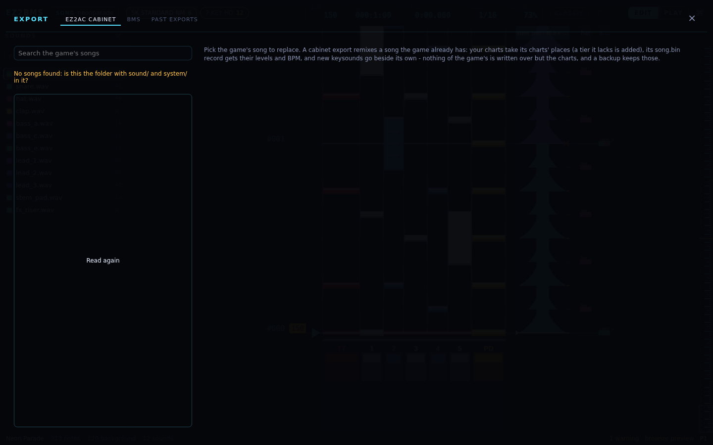
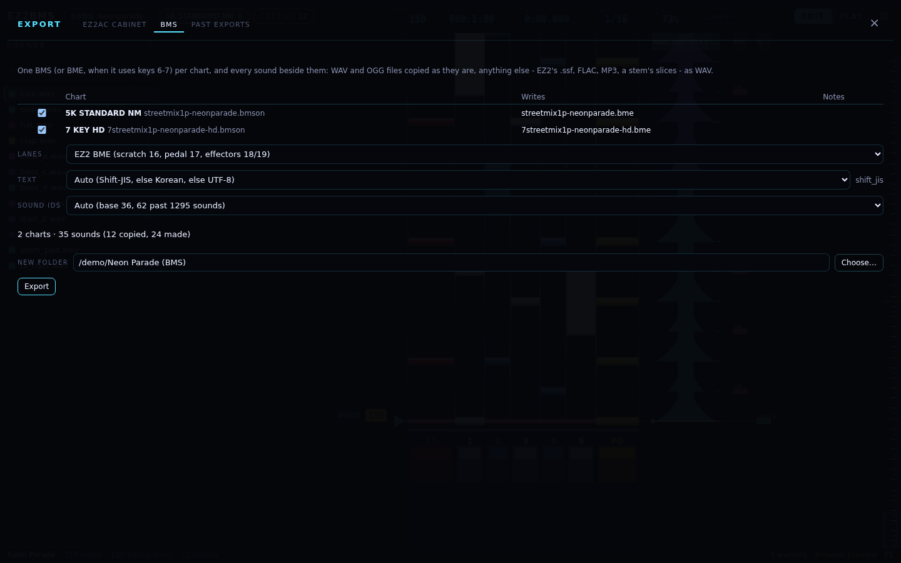

# Exporting

This chapter covers sending your song somewhere other than EZ2PORT: back into the original game on
a cabinet, as a remix of a song the game already has, or out as BMS for LR2, beatoraja and other
BMS players. It also covers undoing an export into the game.

## The Export dialog

Open the Export dialog from the command palette (<kbd>Ctrl</kbd>+<kbd>K</kbd>; on macOS, Ctrl is
Cmd):

- **Export to EZ2AC… (into a song the game has)** opens the **EZ2AC cabinet** tab.
- **Export as BMS…** opens the **BMS** tab.
- **Undo a cabinet export…** opens the **Past exports** tab.

Like publishing, an export works out everything it would write and shows it to you before anything
is written. Press <kbd>Esc</kbd> or click **×** to close the dialog.

## Exporting into the game

A cabinet export **remixes a song the game already has**. Your charts take the places of that
song's charts, and its record in each mode's song table gets their levels and BPM. It can't add a
new song: the game's tables have no room EZ2BMS could safely give it.

### What it needs

It needs your game folder and your unpacked executable, both set on the EZ2PORT tab (see
[Setting up EZ2PORT](05-ez2port-setup.md)). The original game only reads encrypted charts, and the
encryption keys are in the executable. EZ2BMS keeps nothing of the game. Because it needs your game
folder, a cabinet export needs the desktop app.

### Choosing the song to replace

The list on the left shows the game's songs, with each one's title, folder and levels per mode.
Type in **Search the game's songs** to find one by title or folder. **Read again** reads the game
folder again.

EZ2BMS picks the song for you when it can:

- the song the last export went into;
- otherwise the song this song was imported from (see [Importing](15-import.md));
- otherwise you pick one.

If you pick a different song from the one yours came from, the dialog warns you, for example "This
song came from alpha: exporting into beta puts your charts in place of beta's."

### Choosing the charts

The chart table has one row per chart of your song. Untick a chart to leave it out (it then says
**left out**). For each chart it shows:

- **Becomes**: which of the game's chart files it becomes, and whether that **replaces** a file or
  is **new**;
- **Level** and **BPM**, before and after (for example `8 → 11`);
- **Size**, against the 128 KB the original game can load (for example "96.4 KB of 128 KB");
- **.ini**: what happens to the chart's settings file.

A chart that can't go into this song says why beside it: for example the mode's table doesn't list
the song, or it is a second chart for the same mode and tier.

### What changes in the game

For each chart you export:

- **The chart file** is written, encrypted, under the name the game's own file has (its case
  kept). A tier the song lacks gets the name the table implies.
- **Its keysound list** is written, encrypted, in the game's own format.
- **Its `.ini` settings file** is written only when the game would otherwise read different values.
  It is kept when the one there already says the same, and left out when there was none and the
  chart plays by the engine's defaults.
- **Its tier in the song table** always gets your level. The BPM (the one the select screen shows)
  is kept for a chart that is this song's own import and still starts on the tempo it had;
  otherwise it becomes the chart's start tempo. A tier the song lacked also takes its sibling
  tiers' remaining setting when they agree (otherwise 0).

Tiers you don't export stay as they are. The song table is patched in place: only the bytes of
those values change, and nothing else in the table moves.

### Keysounds are never written over

Other songs and charts reach into a song's folder for their sounds, so a file there may be theirs
too. EZ2BMS never replaces one:

- A keysound whose audio (format and samples) is already in the song's folder uses that file.
- Any other keysound gets a name no file has yet, for example `kick~2`.
- A song imported from the game and sent back unedited writes no keysounds at all.
- A keysound in `.wav`, `.ssf` or `.ezw` at 16 bits goes as it is, samples and rate untouched.
  Anything else is converted to 16-bit 44.1 kHz stereo, as publishing does.
- A sound your song lacks keeps its line in the keysound list and writes no file. It plays
  nothing, as the game's own missing sounds do.

### What an imported chart keeps

A chart imported from the game goes back exactly as the game had it, except where you changed it:

- background notes stay on their track;
- raw lengths, velocity, pan and hold kind are kept;
- scroll changes go back on the track, and with the settings, each one had;
- the records bmson has no place for are kept: volume, beats, marks, stops and unknown kinds;
- the header: names, the second BPM, the track count, and the end of the stage;
- the tempo map.

New sounds are placed around the game's own. A chart that didn't come from the game gets the same
layout publishing uses.

### Where it goes

Choose one of two destinations:

- **Into the game folder ... - a backup keeps every file it replaces.** Before writing, every file
  is checked against what the review read: each file it replaces must still be the same, each new
  one must still be absent, and each reused keysound must be unchanged. If anything changed,
  nothing is written, and the dialog says the file "is not what it was when the export was
  planned: plan it again". Otherwise:
  1. the files it replaces are copied into a backup, `.ez2bms-backup/<date>-<time>-<song>/` in
     the game folder, with a list of what it did;
  1. the new files are moved into place;
  1. if anything fails, everything is put back.

  When it's done, the dialog says, for example, "Exported into the game: 3 replaced, 12 added. The
  backup is ...", with the backup's name. Click **Undo this export** to put things back straight away, or
  use [Past exports](#undoing-an-export) later.

- **Into a new folder shaped like the game, to copy onto the cabinet.** Set the **New folder**
  (it starts beside your song as "_song_ (cabinet)"), or click **Choose…**. The folder gets the same
  layout as the game's (`sound/<song>/...`, `system/<mode>/song.bin`), so you can copy it onto the
  cabinet yourself. A file in it, `EZ2BMS-EXPORT.txt`, says what each file replaces. Tick **Also
  copy the keysounds the game already has** to make the folder the whole song. The dialog then says
  "Wrote 18 files into ...".

  **Take care with `song.bin`.** It is your local game's whole table for the mode. Copy it only onto
  a cabinet with the same game version, or the levels of its other songs change with it.

### The review

Under the destination, the dialog sums up the export:

- **Keysounds**: how many are new, how many are already in the folder, how many are missing, and
  how many are converted.
- **Each mode's `song.bin`**: the tiers whose levels change, and how many bytes change, or
  **unchanged**.
- **N things to know**: the checks below.

Errors block **Export**; the button then says why, for example "2 errors to fix first".

| What the check says                                                                                                                                     | Level           |
| ------------------------------------------------------------------------------------------------------------------------------------------------------- | --------------- |
| A chart file is over 131068 bytes: the original game decrypts into a buffer that size and can't load it                                                 | error           |
| More than 2047 keysounds, every slice counted                                                                                                           | error           |
| The mode's table doesn't list the song, or two charts are for one tier                                                                                  | error           |
| A level outside 1-20                                                                                                                                    | error           |
| A keysound file can't be read                                                                                                                           | error           |
| A background sound is cut short by the next sound on its track (the original plays one sound per track). A note where the game's own chart has that cut | warning or note |
| A keyed sound is cut by the lane's next note, in autoplay too                                                                                           | note            |
| Keysounds with no file                                                                                                                                  | warning         |
| A mode would stop listing the song (its NM has no level)                                                                                                | warning         |
| The game's two-player file for the tier stays as it is                                                                                                  | warning         |
| The game has no lane layout file for the mode: EZ2BMS's own lane table is used                                                                          | warning         |
| Kept records fall between EZ2 ticks (was the resolution changed by hand? Changing it in EZ2BMS moves them)                                              | warning         |
| A tier the song didn't have, and the level it will show                                                                                                 | note            |
| Background notes moved off a track that is a lane in this mode, or tracks added                                                                         | note            |
| Records written back                                                                                                                                    | note            |
| Characters in the chart's header name that Korean Windows (CP949) can't write                                                                           | note            |
| Keysounds converted rather than sent as they are                                                                                                        | note            |

Click **Export** to write it.

### How the cabinet differs from EZ2PORT

The original executable is not EZ2PORT, and a chart can play differently on it:

- **One sound per track.** Each track plays one sound at a time, keyed or not, and a new one cuts
  the last. EZ2PORT plays every keysound as its own voice.
- **Loading limits.** A chart file must be at most 131068 bytes, and a chart can use at most 2047
  keysounds.

The review checks all of these. What EZ2BMS could not test is in
[ez2port-compat.md](../ez2port-compat.md) and the owner's checklist in `AI-DISCLOSURE.md`.

## Undoing an export

The **Past exports** tab lists every export into the game folder. Each one kept the files it
replaced. Each row shows the export, when it was made, how many files it has, and whether it is
**applying** (cut off while writing), **applied** (in the game) or **restored** (undone).

Click **Restore** to put back the files the export replaced and take away the ones it added,
wherever each file is still what the export wrote. The toast says, for example, "Restored: 3 put
back, 12 removed". A row already undone says **Restored**.

If a file has changed since the export, EZ2BMS tells you which ("1 file has changed since the
export (...): restoring would lose that.") and replaces it only if you click **Restore anyway**.

The tab needs your game folder to be set on the EZ2PORT tab.

## Exporting as BMS

The **BMS** tab writes your song into a new folder, for LR2, beatoraja and other BMS players:

- one BMS file per chart, named after its bmson;
- every sound beside them, in one flat folder.

### Choosing what to write

The table lists your charts, with the file each one **Writes** and its number of **Notes**. Untick
a chart to leave it out. Then choose:

- **Lanes**: **EZ2 BME (scratch 16, pedal 17, effectors 18/19)**, or **Keys in order (for IIDX/beat
  players)**, which puts each side's keys onto 1-5, 6 and 7. These are the same two layouts the
  importer offers.
- **Text**: **Auto (Shift-JIS, else Korean, else UTF-8)**, **Shift-JIS**, **Korean (CP949)** or
  **UTF-8 (beatoraja)**. The encoding the export will use is shown beside the menu.
- **Sound ids**: **Auto (base 36, 62 past 1295 sounds)**, **Base 36** or **Base 62**.

A summary says how many charts and sounds it will write, and how many sounds are copied or made.
"N things to know" lists what the export had to change or leave out.

Set the **New folder** (it starts beside your song as "_song_ (BMS)"), or click **Choose…**, and
click **Export**. The dialog then says "Wrote 214 files into ...".

### What the BMS files contain

| In the song                    | In the BMS                                                                                                                                            |
| ------------------------------ | ----------------------------------------------------------------------------------------------------------------------------------------------------- |
| lanes                          | **EZ2 BME** (keys 11-15, turntable 16, pedal 17, effectors 18/19; 2P 21-29) or **Keys in order** (each side's keys onto 1-5, 6, 7), as on import      |
| measures                       | EZ2's 4/4 (no `#xxx02`). Each line has as few slots as place its notes exactly; a chart past 999 measures is refused                                  |
| the start tempo, tempo changes | `#BPM`; whole tempos 1-255 on channel 03, the rest on 08 (`#BPMxx`)                                                                                   |
| stops                          | channel 09, `#STOPxx` in 1/192 of a measure; a stop that isn't a whole number of those is written as the decimal it is (beatoraja reads it), and said |
| holds                          | `#LNTYPE 1` pairs on 5x/6x. Two holds that meet on a lane can't both end there, so the first ends a pulse sooner, and said                            |
| the background                 | channel 01, a line per layer                                                                                                                          |
| sounds                         | `#WAVxx`, base 36; `#BASE 62` past 1295 sounds; more than 3843 is refused                                                                             |
| tier, level                    | `#DIFFICULTY` (NM 2, HD 3, SHD 4, EX 5), `#PLAYLEVEL`                                                                                                 |
| eyecatch, preview, movie       | `#STAGEFILE`, `#PREVIEW`, `#BMP01` shown from its start time                                                                                          |
| what an imported BMS said      | `#RANK`, `#DEFEXRANK`, `#TOTAL`, `#LNMODE` as the file had them                                                                                       |

A chart that uses channels 17-19 or 27-29 (EZ2's pedals and effectors, which a BMS player reads as
the 6th and 7th keys) is written as `.bme`; others as `.bms`.

### Text encoding

With **Auto**, the text is Shift-JIS when all of it fits (that is what LR2 reads); otherwise Korean
(CP949); otherwise UTF-8 with a BOM (for beatoraja). The encoding is chosen once for the whole song,
file names included. You can choose one yourself, and the dialog lists what it can't write. A file
name the encoding can't write uses the sound's ASCII name instead.

### Sounds

Each keysound is one file, and one sound table serves all the charts, so charts that share a stem's
slices share its files:

- a whole WAV or OGG is copied as it is, under its own name;
- EZ2's `.ssf` and `.ezw` sounds become WAV files with the same samples;
- FLAC and MP3 are decoded to WAV;
- a slice of a stem is cut to a WAV of its own, sample-exact, the way the cabinet and EZ2PORT cut
  it.

File names are unique, whatever their case.

### What BMS can't hold

These are lost, and the export says so:

- velocity and pan (BMS has neither);
- scroll changes (LR2 has none, and beatoraja's `#SCROLL` jumps where EZ2PORT eases);
- an imported game chart's kept records.

## Details

- **How it's checked.** The cabinet export is proven against EZ2PORT's own chart reader
  (`cabinet.oracle.test.ts`). The BMS export is checked by reading it back with EZ2BMS's own BMS
  reader (`bms-write.test.ts`): random charts come back with every note in its lane, at its exact
  beat, with its length and sound, and at its time to the microsecond.
- **Where the target comes from.** The last export's song is kept in the song file as `cabinet`,
  and the song an import came from as `source.key`. See [song-file.md](../song-file.md).
- **File names.** The game's chart files are `<mode>1p-<key>[-tier].ez`, with the keysound list in
  a `.ezi` (with CRLF line ends, as the game's) and settings in a `.ini` (written compact,
  `Key=value`, with CRLF line ends). The song tables are `system/<mode>/song.bin`. A tier the song lacked takes its siblings'
  `a` value in `song.bin`.
- **The review's rule names**, in the order of the table above: `cabinet-size`, `cabinet-slots`,
  `cabinet-table`, `cabinet-level`, `cabinet-sound-unreadable`, `cabinet-voice-backing`,
  `cabinet-voice-lane`, `cabinet-missing-sound`, `cabinet-song-hidden`, `cabinet-2p`,
  `cabinet-gds`, `cabinet-records-res`, `cabinet-tier-new`, `cabinet-tracks`, `cabinet-kept`,
  `cabinet-name`, `cabinet-convert`.
- A chart that didn't come from the game gets the publish layout: 64 tracks and a closing tempo
  record.

Next: [Preferences and help](17-preferences-and-help.md)
