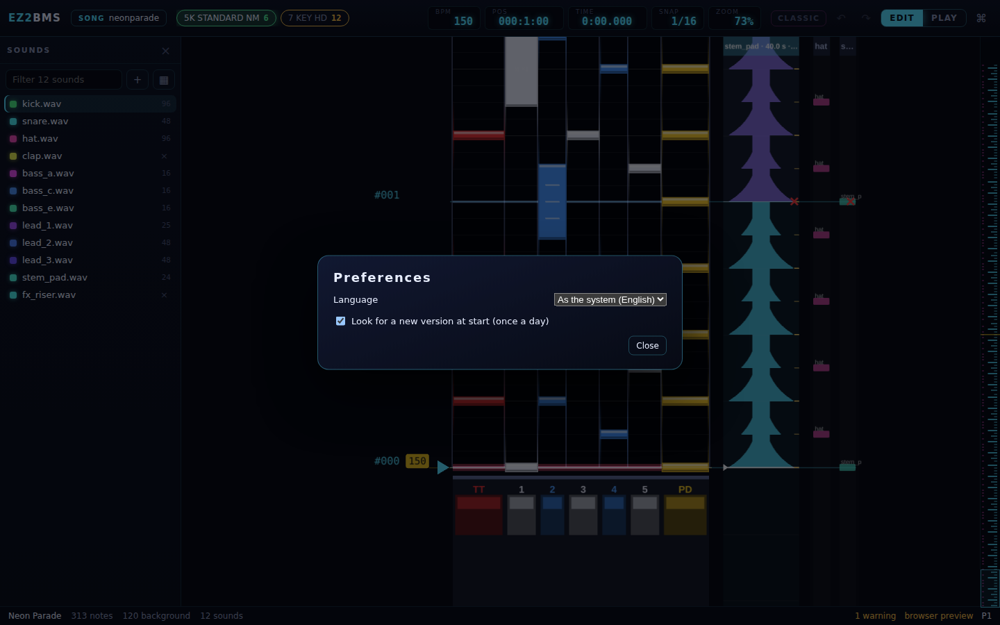
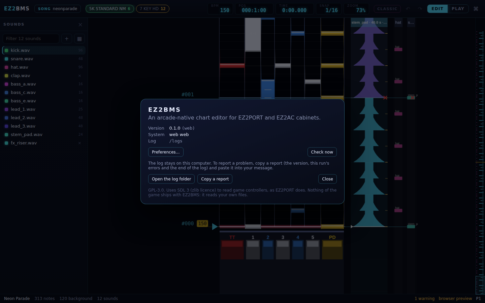

# Preferences and help

This chapter covers the app-wide settings (language and updates), the About box and bug reports,
what happens after a crash, how autosave protects your work, updating EZ2BMS, and where your
settings are kept.

## Preferences

Press <kbd>Ctrl</kbd>+<kbd>,</kbd> (or run **Preferences (language, updates)** from the command
palette) to open **Preferences**. Changes apply at once; click **Close** or press <kbd>Esc</kbd>
when you're done.



Preferences holds only the choices that aren't about a song. Your game folder and EZ2PORT live in
the [EZ2PORT tab](05-ez2port-setup.md), and your keys, controllers and timing offsets in the
Controls dialog (see [Controllers and timing](11-controllers.md)).

### Language

Choose the language of the whole app under **Language**:

- **As the system (…)**: follow your system's language. The brackets show which language that is
  now. Korean and Japanese systems get Korean and Japanese; any other language gets English. This
  is the default.
- **English**
- **한국어** (Korean)
- **日本語** (Japanese)

Each language is listed in its own words, whatever language the app is in. The app switches as
soon as you choose.

When the app is in Korean or Japanese, Preferences also says
**Korean and Japanese are first translations, drafted by an AI: corrections are welcome.** They
haven't been read by a native speaker yet. If something reads wrong, please report it.

This manual and the key reference are in English only.

### Look for a new version at start

With **Look for a new version at start (once a day)** ticked, EZ2BMS looks for a new release when
it starts, at most once a day. Untick it to look only when you ask (see [Updates](#updates)).

If your copy of EZ2BMS was built without the project's update key, this checkbox is replaced by
**This build cannot update itself (it was built without the update key).**

## About EZ2BMS

Run **About EZ2BMS** from the command palette (<kbd>Ctrl</kbd>+<kbd>K</kbd>) to open the About box.



It shows:

- **Version**: the version of EZ2BMS, with the exact build in brackets;
- **System**: your operating system and processor;
- **Settings**, **Cache** and **Log**: the folders where EZ2BMS keeps your settings, its cache and
  its log (desktop app);
- after a run that didn't close properly, a line saying so (see
  [After a crash](#after-a-crash));
- when something went wrong during this run, how many errors there were and the last one.

The buttons:

- **Preferences…** opens Preferences.
- **Check now** looks for a new version straight away.
- **Open the log folder** shows the log folder in your file manager.
- **Copy a report** copies a problem report to the clipboard (see below).
- **Close** closes the box.

### Copying a report for a bug

EZ2BMS keeps a log on your computer. It never sends it anywhere. When you want to report a problem:

1. Open **About EZ2BMS** and click **Copy a report**, or run the **Copy a problem report (version,
   errors, the end of the log)** command. A message says **Copied a report: paste it into a bug
   report or a message**.
2. Paste it into your bug report or message.

The report has the version and build, your system, whether the previous run closed properly, this
run's errors, and the end of the log. It's always in English, whatever language the app is in, so
that whoever fixes the problem can read it. Look it over before you send it if you like: it's
plain text.

## When something goes wrong

If a command fails, a message in the corner says which command and why. If something fails that
EZ2BMS didn't expect, the message says **Something went wrong:** and what, and that the log has the
details. The error goes into the log and into the About box, so you can copy a report afterwards.

### After a crash

If EZ2BMS closed without shutting down properly last time (it crashed, was killed, or the power went
out), the next start shows **EZ2BMS closed unexpectedly last time. The log may say why.** with a
**Details** button. **Details** opens the About box, which says which version was running and when
it started, and that the autosave kept your unsaved charts. From there you can open the log folder
or copy a report.

## Autosave and recovery

You don't have to remember to save to be safe from a crash. A few seconds after you stop editing,
EZ2BMS writes each chart with unsaved changes to its own folder (never into your song folder). When
you save, those copies are cleared.

When you open a song and there is an autosaved chart newer than the chart file in the song folder,
EZ2BMS offers it back with a message such as **Unsaved changes to 7streetmix1p-neonparade-hd.bmson
from (a date and time) were kept after EZ2BMS closed.** and a **Recover** button:

1. Click **Recover**. The chart comes back as it was when it was autosaved, and a message says
   **Recovered**, the chart's file name, and **save to keep it**.
2. Look it over, then press <kbd>Ctrl</kbd>+<kbd>S</kbd> to keep it.

If you don't click **Recover**, the chart file in your song folder stays as it is. The offer goes
away after about 15 seconds; open the song again to see it again.

When you open another song while this one has unsaved changes, EZ2BMS asks first: it says the song
has unsaved changes and that the autosave keeps them, with an **Open** button to go ahead.

## Updates

The Windows installer and the AppImage can update themselves from the project's releases. (The
Linux `.deb` is updated by your package manager instead, and the browser preview doesn't update.)

### How EZ2BMS tells you

- **At start**, if **Look for a new version at start** is on, EZ2BMS looks at most once a day. It
  waits a few seconds after starting, and never interrupts while a chart is playing or recording.
  When there's a new version, a message says so, for example **EZ2BMS 0.3.0 is out (you have
  0.2.0).** Click **What's new** to open the update dialog.
- **When you ask**, with **Check now** in the About box or the **Check for updates** command, the
  dialog opens straight away if there is a new version. Otherwise a message says
  **EZ2BMS is up to date**, or why it couldn't look.

### The update dialog

The dialog shows the new version, the version you have, when it was published, and what changed.
Its buttons:

- **Install and restart** downloads the update, shows its progress, installs it and starts EZ2BMS
  again on the new version. Save your charts first: if you have unsaved changes, the dialog says
  **Save your charts first: installing restarts EZ2BMS.** and won't install until you've saved.
- **Skip this version** stops EZ2BMS offering this version at start. You'll hear about the next
  one.
- **Later** closes the dialog. You'll be told again another day.

On a `.deb` install, the dialog explains that your package manager updates EZ2BMS, and
**Open the release page** takes you to the download.

Every update is signed by the project, and EZ2BMS checks the signature before it installs anything.
Nothing is sent to anyone but the request for the newest release.

## Where your settings are kept

EZ2BMS saves your settings a moment after each change. In the desktop app they're in a file named
`settings.json`, in the **Settings** folder the About box shows. Usually that's:

- Windows: `%APPDATA%\io.github.roganis.ez2bms\`
- Linux: `~/.config/io.github.roganis.ez2bms/`

The autosaved charts are in an `autosave` folder beside it. The log and the long-sound cache have
folders of their own, also shown in the About box.

The settings file holds your game folder and EZ2PORT paths, recent songs, the player side and
speed, your controls, timing offsets and record options, the language, the update settings and
any shortcut changes.

In the browser preview, settings are kept in the browser's own storage instead.

## Changing editor shortcuts

EZ2BMS has no screen for changing shortcuts yet, but you can change them in the settings file, under
`keys`. Each entry names a command and the keys you want for it; your keys replace the command's
default keys.

1. Quit EZ2BMS. (It rewrites the settings file when a setting changes, and reads your shortcuts
   when it starts.)
2. Open `settings.json` in a text editor and find `"keys": {}`.
3. Add your shortcuts, then save the file and start EZ2BMS again.

Take care to keep the file valid JSON (commas between entries, quotes around names). If EZ2BMS
can't read the file, it starts with its default settings, and replaces the file with them the next
time a setting changes. A copy of the file before you edit it is a good idea.

For example, to test in EZ2PORT with <kbd>F6</kbd> instead of <kbd>F5</kbd>, and to have both
<kbd>Space</kbd> and <kbd>P</kbd> play and stop:

```json
"keys": {
  "port.test": ["F6"],
  "play.toggle": ["Space", "P"]
}
```

How to write keys:

- `Mod` is <kbd>Ctrl</kbd> (<kbd>Cmd</kbd> on macOS), and `Shift` and `Alt` are themselves, joined
  with `+`: `Mod+Shift+P`.
- Letters are capitals (`D`, `Shift+Q`); other keys go by their names, such as `F5`, `Space`,
  `Tab`, `Home`, `PageUp`, `Delete`, `Escape`, `ArrowUp` or `ArrowLeft`; and symbols as they are,
  such as `[` or `]`.

Some command names:

| Command                     | Name in `keys`    | Default keys                                  |
| --------------------------- | ----------------- | --------------------------------------------- |
| Save                        | `file.save`       | <kbd>Ctrl</kbd>+<kbd>S</kbd>                  |
| Undo                        | `edit.undo`       | <kbd>Ctrl</kbd>+<kbd>Z</kbd>                  |
| Command palette             | `view.palette`    | <kbd>Ctrl</kbd>+<kbd>K</kbd>                  |
| Switch Edit / Play view     | `view.togglePlay` | <kbd>Tab</kbd>                                |
| Draw tool                   | `tool.draw`       | <kbd>D</kbd>                                  |
| Select tool                 | `tool.select`     | <kbd>V</kbd>                                  |
| Long note on/off            | `notes.hold`      | <kbd>L</kbd>                                  |
| Play / stop from the cursor | `play.toggle`     | <kbd>Space</kbd>                              |
| Test play from the cursor   | `play.test`       | <kbd>Shift</kbd>+<kbd>Tab</kbd>               |
| Test in EZ2PORT             | `port.test`       | <kbd>F5</kbd>                                 |
| Publish to EZ2PORT          | `port.publish`    | <kbd>Ctrl</kbd>+<kbd>Shift</kbd>+<kbd>P</kbd> |

Every command and its default keys are in the [key reference](../keybindings.md).

These are the editor's shortcuts. The game keys you play with in test play come from EZ2PORT's
`keys.ini` or the Controls dialog; see [Controllers and timing](11-controllers.md).

Next: [Troubleshooting](18-troubleshooting.md)
